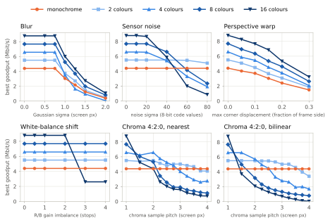
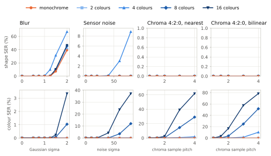
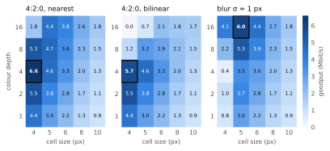

**These are simulated results: they predict what the capture study should find; they do not measure it.** No camera, display or optics was involved; every number below comes from rendering, synthetically degrading and decoding frames in software.

# Pilot study: simulated goodput vs colour depth and cell size

Generated by `python -m prism_share.sim.pilot --config experiments/pilot.yaml` (25 configurations, 46 conditions, **200 frames per condition**, 4 decoder variants; 226 min on 10 cores). Full per-condition results: [`pilot_summary.csv`](pilot/pilot_summary.csv).

## Headline

* **Decoder:** `luma/saturated`, pre-registered on 2026-09-14 before any real capture, for reasons stated in README section 8.1 that do not depend on these results. The other three decoders are sensitivity analysis only.
* **Count:** a configuration with more than one colour maximises goodput in **42 of 46** conditions as measured, and **42 of 46** with the index band's cells credited back. The winning configuration is identical in both columns in 46 of 46 conditions.
* **How much of that is decided:** a condition counts as decided only if the winner beats the best configuration of the other class (monochrome vs colour) by at least 5 %. Decided colour wins: **41**. Decided monochrome wins: **4**. Near-ties: **1**: chroma_bilinear @ 3.5 (4.6 %).
* **Winner vs runner-up (any configuration) under 5 %:** **5**: chroma_bilinear @ 2 (depth 4, 4 px vs depth 2, 4 px, 3.7 %), chroma_bilinear @ 3.5 (depth 2, 4 px vs depth 1, 4 px, 4.6 %), chroma_nearest @ 1.5 (depth 4, 4 px vs depth 8, 4 px, 3.2 %), chroma_nearest @ 2.75 (depth 2, 4 px vs depth 4, 4 px, 4.1 %), perspective @ 0.2 (depth 16, 5 px vs depth 16, 4 px, 2.7 %). These do not move the count unless the runner-up is of the other class, which the class margin above already covers; they mean the *identity* of the best configuration is not settled there.
* **Monochrome wins at:** chroma_bilinear @ 3.75, chroma_bilinear @ 4, chroma_nearest @ 3.75, chroma_nearest @ 4.

## RS code chosen out of sample

Every goodput in this report is **out of sample**. Each condition's 200 frames are split by frame position (even → selection, odd → evaluation; `params.RS_SELECTION_PERIOD`), so the split is the same for every configuration in a condition and comparisons stay paired. The goodput-maximising RS(n, k) is chosen on the 100 selection frames. Yield and goodput are scored only on the 100 evaluation frames, with that code. The fixed RS(155,125) columns are scored on the evaluation half too, so every yield in the tables uses the same frames.

Choosing the code on the frames it is scored on (in sample) is shown here only to measure the bias that was removed:

| decoder | mean goodput, in sample (all frames) | mean goodput, out of sample | mean fall | mean fall where it changed | largest fall | cells fell / rose / of | vs in-sample optimum on the evaluation half | colour wins in sample → out of sample |
|---|---:|---:|---:|---:|---:|---:|---:|---:|
| luma/saturated (headline) | 2.4798 | 2.4684 | 0.0114 Mbit/s (0.60 %) | 1.83 % | 39.5 % | 278 / 67 / 1150 | 0.0102 Mbit/s | 42 → 42 |
| max/mean | 2.1995 | 2.1898 | 0.0097 Mbit/s (0.83 %) | 2.72 % | 100.0 % | 242 / 52 / 1150 | 0.0080 Mbit/s | 34 → 34 |
| max/saturated | 2.4571 | 2.4455 | 0.0116 Mbit/s (0.69 %) | 2.10 % | 34.0 % | 288 / 55 / 1150 | 0.0100 Mbit/s | 42 → 42 |
| luma/mean | 2.1993 | 2.1888 | 0.0105 Mbit/s (0.86 %) | 2.60 % | 100.0 % | 266 / 54 / 1150 | 0.0093 Mbit/s | 34 → 34 |

Conditions whose winner differs between in-sample and out-of-sample scoring (`luma/saturated`):

| condition | winner in sample | Mbit/s | winner out of sample | Mbit/s | class changed |
|---|---|---:|---|---:|---|
| perspective @ 0.2 | depth 16, 4 px | 5.440 | depth 16, 5 px | 5.334 | no |

Conditions that change class (colour ↔ monochrome) under `luma/saturated`: **0**.

## Chroma-pitch ladder

Best colour configuration against best monochrome along the chroma-pitch ladder. *Colour lead* = (best colour − best monochrome) / best monochrome. Positive means colour wins. A crossing is a linear interpolation of the lead between adjacent rungs, so it is only as trustworthy as the lead is smooth between them.

| pitch | chroma_nearest: winner | colour lead | chroma_bilinear: winner | colour lead |
|---:|---|---:|---|---:|
| 1 | depth 16, 4 px | +100.1 % | depth 16, 4 px | +100.1 % |
| 1.5 | depth 4, 4 px | +41.8 % | depth 4, 4 px | +49.7 % |
| 2 | depth 4, 4 px | +49.7 % | depth 4, 4 px | +29.8 % |
| 2.25 | depth 4, 4 px | +31.2 % | depth 2, 4 px | +24.4 % |
| 2.5 | depth 4, 4 px | +19.5 % | depth 2, 4 px | +24.4 % |
| 2.75 | depth 2, 4 px | +14.3 % | depth 2, 4 px | +21.3 % |
| 3 | depth 2, 4 px | +14.3 % | depth 2, 4 px | +14.3 % |
| 3.25 | depth 2, 4 px | +10.1 % | depth 2, 4 px | +14.4 % |
| 3.5 | depth 2, 4 px | +6.6 % | depth 2, 4 px | +4.6 % |
| 3.75 | depth 1, 4 px | -6.5 % | depth 1, 4 px | -9.8 % |
| 4 | depth 1, 4 px | -7.1 % | depth 1, 4 px | -22.7 % |

Where colour and monochrome cross (interpolated pitch, and the rungs that bracket it), `luma/saturated`:

* **chroma_nearest:** ≈ 3.63 (between 3.5 and 3.75).
* **chroma_bilinear:** ≈ 3.58 (between 3.5 and 3.75).

Sensitivity: the same crossing under every decoder.

| decoder | chroma_nearest | chroma_bilinear |
|---|---|---|
| luma/saturated (headline) | ≈ 3.63 (between 3.5 and 3.75) | ≈ 3.58 (between 3.5 and 3.75) |
| max/mean | ≈ 2.34 (between 2.25 and 2.5) | ≈ 2.94 (between 2.75 and 3) |
| max/saturated | ≈ 3.63 (between 3.5 and 3.75) | ≈ 3.58 (between 3.5 and 3.75) |
| luma/mean | ≈ 2.34 (between 2.25 and 2.5) | ≈ 2.96 (between 2.75 and 3) |

## Margin table (pre-registered decoder, goodput as measured)

*margin* = how much the winner beats the runner-up (any configuration); *class margin* = how much it beats the best configuration of the other class, the margin that decides the count. Both in percent of the loser's goodput. Flags mark margins under 5 %. Goodput is out of sample: the RS code is chosen on the selection half and scored on the evaluation half.

| condition | winner | Mbit/s | runner-up | Mbit/s | margin | best of other class | Mbit/s | class margin | flag |
|---|---|---:|---|---:|---:|---|---:|---:|---|
| blur @ 0.5 | depth 16, 4 px | 8.792 | depth 8, 4 px | 7.683 | 14.4 % | depth 1, 4 px | 4.393 | 100.1 % | – |
| blur @ 0.75 | depth 16, 4 px | 8.792 | depth 8, 4 px | 7.683 | 14.4 % | depth 1, 4 px | 4.393 | 100.1 % | – |
| blur @ 1 | depth 16, 5 px | 6.019 | depth 8, 5 px | 5.254 | 14.6 % | depth 1, 5 px | 3.043 | 97.8 % | – |
| blur @ 1.25 | depth 16, 6 px | 4.323 | depth 8, 6 px | 3.693 | 17.1 % | depth 1, 6 px | 2.170 | 99.2 % | – |
| blur @ 1.5 | depth 16, 6 px | 2.742 | depth 16, 8 px | 2.308 | 18.8 % | depth 1, 6 px | 1.231 | 122.8 % | – |
| blur @ 2 | depth 16, 10 px | 1.066 | depth 16, 8 px | 0.848 | 25.7 % | depth 1, 10 px | 0.386 | 176.1 % | – |
| chroma_bilinear @ 1 | depth 16, 4 px | 8.792 | depth 8, 4 px | 7.683 | 14.4 % | depth 1, 4 px | 4.393 | 100.1 % | – |
| chroma_bilinear @ 1.5 | depth 4, 4 px | 6.579 | depth 2, 4 px | 5.502 | 19.6 % | depth 1, 4 px | 4.393 | 49.7 % | – |
| chroma_bilinear @ 2 | depth 4, 4 px | 5.705 | depth 2, 4 px | 5.502 | 3.7 % | depth 1, 4 px | 4.393 | 29.8 % | near-tie |
| chroma_bilinear @ 2.25 | depth 2, 4 px | 5.466 | depth 4, 4 px | 4.958 | 10.3 % | depth 1, 4 px | 4.393 | 24.4 % | – |
| chroma_bilinear @ 2.5 | depth 2, 4 px | 5.466 | depth 4, 4 px | 4.466 | 22.4 % | depth 1, 4 px | 4.393 | 24.4 % | – |
| chroma_bilinear @ 2.75 | depth 2, 4 px | 5.330 | depth 1, 4 px | 4.393 | 21.3 % | depth 1, 4 px | 4.393 | 21.3 % | – |
| chroma_bilinear @ 3 | depth 2, 4 px | 5.023 | depth 1, 4 px | 4.393 | 14.3 % | depth 1, 4 px | 4.393 | 14.3 % | – |
| chroma_bilinear @ 3.25 | depth 2, 4 px | 5.028 | depth 1, 4 px | 4.393 | 14.4 % | depth 1, 4 px | 4.393 | 14.4 % | – |
| chroma_bilinear @ 3.5 | depth 2, 4 px | 4.596 | depth 1, 4 px | 4.393 | 4.6 % | depth 1, 4 px | 4.393 | 4.6 % | **class near-tie**, near-tie |
| chroma_bilinear @ 3.75 | depth 1, 4 px | 4.393 | depth 2, 4 px | 3.965 | 10.8 % | depth 2, 4 px | 3.965 | 10.8 % | – |
| chroma_bilinear @ 4 | depth 1, 4 px | 4.393 | depth 2, 5 px | 3.398 | 29.3 % | depth 2, 5 px | 3.398 | 29.3 % | – |
| chroma_bt709_bilinear @ 2 | depth 2, 4 px | 5.502 | depth 4, 5 px | 4.578 | 20.2 % | depth 1, 4 px | 4.393 | 25.2 % | – |
| chroma_bt709_nearest @ 2 | depth 4, 4 px | 6.579 | depth 2, 4 px | 5.502 | 19.6 % | depth 1, 4 px | 4.393 | 49.7 % | – |
| chroma_nearest @ 1 | depth 16, 4 px | 8.792 | depth 8, 4 px | 7.683 | 14.4 % | depth 1, 4 px | 4.393 | 100.1 % | – |
| chroma_nearest @ 1.5 | depth 4, 4 px | 6.231 | depth 8, 4 px | 6.036 | 3.2 % | depth 1, 4 px | 4.393 | 41.8 % | near-tie |
| chroma_nearest @ 2 | depth 4, 4 px | 6.579 | depth 2, 4 px | 5.502 | 19.6 % | depth 1, 4 px | 4.393 | 49.7 % | – |
| chroma_nearest @ 2.25 | depth 4, 4 px | 5.762 | depth 2, 4 px | 5.129 | 12.4 % | depth 1, 4 px | 4.393 | 31.2 % | – |
| chroma_nearest @ 2.5 | depth 4, 4 px | 5.250 | depth 2, 4 px | 4.812 | 9.1 % | depth 1, 4 px | 4.393 | 19.5 % | – |
| chroma_nearest @ 2.75 | depth 2, 4 px | 5.020 | depth 4, 4 px | 4.823 | 4.1 % | depth 1, 4 px | 4.393 | 14.3 % | near-tie |
| chroma_nearest @ 3 | depth 2, 4 px | 5.020 | depth 1, 4 px | 4.393 | 14.3 % | depth 1, 4 px | 4.393 | 14.3 % | – |
| chroma_nearest @ 3.25 | depth 2, 4 px | 4.835 | depth 1, 4 px | 4.393 | 10.1 % | depth 1, 4 px | 4.393 | 10.1 % | – |
| chroma_nearest @ 3.5 | depth 2, 4 px | 4.682 | depth 1, 4 px | 4.393 | 6.6 % | depth 1, 4 px | 4.393 | 6.6 % | – |
| chroma_nearest @ 3.75 | depth 1, 4 px | 4.393 | depth 2, 4 px | 4.106 | 7.0 % | depth 2, 4 px | 4.106 | 7.0 % | – |
| chroma_nearest @ 4 | depth 1, 4 px | 4.393 | depth 2, 4 px | 4.080 | 7.7 % | depth 2, 4 px | 4.080 | 7.7 % | – |
| clean @ 0 | depth 16, 4 px | 8.792 | depth 8, 4 px | 7.683 | 14.4 % | depth 1, 4 px | 4.393 | 100.1 % | – |
| noise @ 10 | depth 16, 4 px | 8.792 | depth 8, 4 px | 7.683 | 14.4 % | depth 1, 4 px | 4.393 | 100.1 % | – |
| noise @ 20 | depth 16, 4 px | 8.670 | depth 8, 4 px | 7.683 | 12.8 % | depth 1, 4 px | 4.393 | 97.3 % | – |
| noise @ 40 | depth 8, 4 px | 6.604 | depth 16, 4 px | 5.868 | 12.6 % | depth 1, 4 px | 4.393 | 50.3 % | – |
| noise @ 60 | depth 2, 4 px | 5.466 | depth 1, 4 px | 4.393 | 24.4 % | depth 1, 4 px | 4.393 | 24.4 % | – |
| noise @ 80 | depth 2, 4 px | 5.087 | depth 1, 4 px | 4.393 | 15.8 % | depth 1, 4 px | 4.393 | 15.8 % | – |
| perspective @ 0.05 | depth 16, 4 px | 8.255 | depth 8, 4 px | 6.934 | 19.1 % | depth 1, 4 px | 4.015 | 105.6 % | – |
| perspective @ 0.1 | depth 16, 4 px | 7.659 | depth 8, 4 px | 6.344 | 20.7 % | depth 1, 4 px | 3.704 | 106.8 % | – |
| perspective @ 0.15 | depth 16, 4 px | 6.850 | depth 16, 5 px | 5.805 | 18.0 % | depth 1, 4 px | 3.033 | 125.9 % | – |
| perspective @ 0.2 | depth 16, 5 px | 5.334 | depth 16, 4 px | 5.195 | 2.7 % | depth 1, 5 px | 2.404 | 121.9 % | near-tie |
| perspective @ 0.3 | depth 16, 6 px | 3.239 | depth 16, 5 px | 3.037 | 6.6 % | depth 1, 6 px | 1.487 | 117.8 % | – |
| white_balance @ 0.5 | depth 16, 4 px | 8.792 | depth 8, 4 px | 7.683 | 14.4 % | depth 1, 4 px | 4.393 | 100.1 % | – |
| white_balance @ 1 | depth 16, 4 px | 8.792 | depth 8, 4 px | 7.683 | 14.4 % | depth 1, 4 px | 4.393 | 100.1 % | – |
| white_balance @ 2 | depth 16, 4 px | 8.792 | depth 8, 4 px | 7.683 | 14.4 % | depth 1, 4 px | 4.393 | 100.1 % | – |
| white_balance @ 3 | depth 8, 4 px | 7.683 | depth 4, 4 px | 6.579 | 16.8 % | depth 1, 4 px | 4.393 | 74.9 % | – |
| white_balance @ 4 | depth 8, 4 px | 7.683 | depth 4, 4 px | 6.579 | 16.8 % | depth 1, 4 px | 4.393 | 74.9 % | – |

## Band-credited check (pre-registered decoder)

The index band is measurement apparatus, not codec, and its cell cost varies with cell size (2.83 % at 4 px, 2.93 % at 5 px, 3.45 % at 6 px, 3.68 % at 8 px, 3.57 % at 10 px). This table re-ranks every condition with the band's cells credited back (same RS code, same yield, payload of the band-free grid).

| condition | winner (measured) | winner (band credited) | same | class margin (credited) | flag |
|---|---|---|---|---:|---|
| blur @ 0.5 | depth 16, 4 px | depth 16, 4 px | yes | 100.9 % | – |
| blur @ 0.75 | depth 16, 4 px | depth 16, 4 px | yes | 100.9 % | – |
| blur @ 1 | depth 16, 5 px | depth 16, 5 px | yes | 99.7 % | – |
| blur @ 1.25 | depth 16, 6 px | depth 16, 6 px | yes | 98.1 % | – |
| blur @ 1.5 | depth 16, 6 px | depth 16, 6 px | yes | 122.7 % | – |
| blur @ 2 | depth 16, 10 px | depth 16, 10 px | yes | 166.4 % | – |
| chroma_bilinear @ 1 | depth 16, 4 px | depth 16, 4 px | yes | 100.9 % | – |
| chroma_bilinear @ 1.5 | depth 4, 4 px | depth 4, 4 px | yes | 50.1 % | – |
| chroma_bilinear @ 2 | depth 4, 4 px | depth 4, 4 px | yes | 30.9 % | – |
| chroma_bilinear @ 2.25 | depth 2, 4 px | depth 2, 4 px | yes | 24.6 % | – |
| chroma_bilinear @ 2.5 | depth 2, 4 px | depth 2, 4 px | yes | 24.6 % | – |
| chroma_bilinear @ 2.75 | depth 2, 4 px | depth 2, 4 px | yes | 22.3 % | – |
| chroma_bilinear @ 3 | depth 2, 4 px | depth 2, 4 px | yes | 15.2 % | – |
| chroma_bilinear @ 3.25 | depth 2, 4 px | depth 2, 4 px | yes | 15.4 % | – |
| chroma_bilinear @ 3.5 | depth 2, 4 px | depth 2, 4 px | yes | 5.4 % | – |
| chroma_bilinear @ 3.75 | depth 1, 4 px | depth 1, 4 px | yes | 10.6 % | – |
| chroma_bilinear @ 4 | depth 1, 4 px | depth 1, 4 px | yes | 28.4 % | – |
| chroma_bt709_bilinear @ 2 | depth 2, 4 px | depth 2, 4 px | yes | 25.4 % | – |
| chroma_bt709_nearest @ 2 | depth 4, 4 px | depth 4, 4 px | yes | 50.1 % | – |
| chroma_nearest @ 1 | depth 16, 4 px | depth 16, 4 px | yes | 100.9 % | – |
| chroma_nearest @ 1.5 | depth 4, 4 px | depth 4, 4 px | yes | 42.2 % | – |
| chroma_nearest @ 2 | depth 4, 4 px | depth 4, 4 px | yes | 50.1 % | – |
| chroma_nearest @ 2.25 | depth 4, 4 px | depth 4, 4 px | yes | 32.2 % | – |
| chroma_nearest @ 2.5 | depth 4, 4 px | depth 4, 4 px | yes | 20.5 % | – |
| chroma_nearest @ 2.75 | depth 2, 4 px | depth 2, 4 px | yes | 15.2 % | – |
| chroma_nearest @ 3 | depth 2, 4 px | depth 2, 4 px | yes | 15.2 % | – |
| chroma_nearest @ 3.25 | depth 2, 4 px | depth 2, 4 px | yes | 10.9 % | – |
| chroma_nearest @ 3.5 | depth 2, 4 px | depth 2, 4 px | yes | 7.4 % | – |
| chroma_nearest @ 3.75 | depth 1, 4 px | depth 1, 4 px | yes | 6.8 % | – |
| chroma_nearest @ 4 | depth 1, 4 px | depth 1, 4 px | yes | 6.8 % | – |
| clean @ 0 | depth 16, 4 px | depth 16, 4 px | yes | 100.9 % | – |
| noise @ 10 | depth 16, 4 px | depth 16, 4 px | yes | 100.9 % | – |
| noise @ 20 | depth 16, 4 px | depth 16, 4 px | yes | 99.2 % | – |
| noise @ 40 | depth 8, 4 px | depth 8, 4 px | yes | 51.3 % | – |
| noise @ 60 | depth 2, 4 px | depth 2, 4 px | yes | 24.6 % | – |
| noise @ 80 | depth 2, 4 px | depth 2, 4 px | yes | 16.7 % | – |
| perspective @ 0.05 | depth 16, 4 px | depth 16, 4 px | yes | 107.0 % | – |
| perspective @ 0.1 | depth 16, 4 px | depth 16, 4 px | yes | 108.2 % | – |
| perspective @ 0.15 | depth 16, 4 px | depth 16, 4 px | yes | 127.4 % | – |
| perspective @ 0.2 | depth 16, 5 px | depth 16, 5 px | yes | 124.1 % | – |
| perspective @ 0.3 | depth 16, 6 px | depth 16, 6 px | yes | 117.8 % | – |
| white_balance @ 0.5 | depth 16, 4 px | depth 16, 4 px | yes | 100.9 % | – |
| white_balance @ 1 | depth 16, 4 px | depth 16, 4 px | yes | 100.9 % | – |
| white_balance @ 2 | depth 16, 4 px | depth 16, 4 px | yes | 100.9 % | – |
| white_balance @ 3 | depth 8, 4 px | depth 8, 4 px | yes | 75.5 % | – |
| white_balance @ 4 | depth 8, 4 px | depth 8, 4 px | yes | 75.5 % | – |

## Sensitivity: every decoder, both goodput columns

| decoder | goodput column | colour wins | colour wins, class margin >= 5 % | monochrome wins | monochrome wins, class margin >= 5 % | near-ties (class margin < 5 %) | monochrome wins at |
|---|---|---|---|---|---|---|---|
| luma/saturated (pre-registered headline) | measured | 42 / 46 | 41 | 4 | 4 | 1 | chroma_bilinear@3.75, chroma_bilinear@4, chroma_nearest@3.75, chroma_nearest@4 |
| luma/saturated (pre-registered headline) | band credited | 42 / 46 | 42 | 4 | 4 | 0 | chroma_bilinear@3.75, chroma_bilinear@4, chroma_nearest@3.75, chroma_nearest@4 |
| max/mean (sensitivity) | measured | 34 / 46 | 34 | 12 | 10 | 2 | chroma_bilinear@3, chroma_bilinear@3.25, chroma_bilinear@3.5, chroma_bilinear@3.75, chroma_bilinear@4, chroma_nearest@2.5, chroma_nearest@2.75, chroma_nearest@3, chroma_nearest@3.25, chroma_nearest@3.5, chroma_nearest@3.75, chroma_nearest@4 |
| max/mean (sensitivity) | band credited | 34 / 46 | 34 | 12 | 9 | 3 | chroma_bilinear@3, chroma_bilinear@3.25, chroma_bilinear@3.5, chroma_bilinear@3.75, chroma_bilinear@4, chroma_nearest@2.5, chroma_nearest@2.75, chroma_nearest@3, chroma_nearest@3.25, chroma_nearest@3.5, chroma_nearest@3.75, chroma_nearest@4 |
| max/saturated (sensitivity) | measured | 42 / 46 | 41 | 4 | 4 | 1 | chroma_bilinear@3.75, chroma_bilinear@4, chroma_nearest@3.75, chroma_nearest@4 |
| max/saturated (sensitivity) | band credited | 42 / 46 | 42 | 4 | 4 | 0 | chroma_bilinear@3.75, chroma_bilinear@4, chroma_nearest@3.75, chroma_nearest@4 |
| luma/mean (sensitivity) | measured | 34 / 46 | 34 | 12 | 10 | 2 | chroma_bilinear@3, chroma_bilinear@3.25, chroma_bilinear@3.5, chroma_bilinear@3.75, chroma_bilinear@4, chroma_nearest@2.5, chroma_nearest@2.75, chroma_nearest@3, chroma_nearest@3.25, chroma_nearest@3.5, chroma_nearest@3.75, chroma_nearest@4 |
| luma/mean (sensitivity) | band credited | 34 / 46 | 34 | 12 | 9 | 3 | chroma_bilinear@3, chroma_bilinear@3.25, chroma_bilinear@3.5, chroma_bilinear@3.75, chroma_bilinear@4, chroma_nearest@2.5, chroma_nearest@2.75, chroma_nearest@3, chroma_nearest@3.25, chroma_nearest@3.5, chroma_nearest@3.75, chroma_nearest@4 |

## Interpretation

<!-- interpretation -->
*This section is written by hand. The generator preserves it on regeneration, so re-check its numbers against the tables whenever the pilot is re-run. Numbers below were re-checked on 2026-09-15 against the 200-frame, frame-format-2 run with out-of-sample RS selection and the widened chroma ladder (46 conditions), using the pre-registered `luma/saturated` decoder unless a sensitivity variant is named. SERs are not selected on anything and use all 200 frames; every goodput uses the evaluation half.*

**In this simulation, the hypothesis is not supported, and the whole result is where chroma pitch crosses about 3.6.** A colour depth above 1 maximises goodput in 42 of 46 conditions, and in 32 of the original 34, the same count as before the RS code was chosen out of sample. Monochrome wins only at chroma pitch 3.75 and 4, with either upsampling method: by 7.0 % and 7.7 % (nearest) and by 10.8 % and 29.3 % (bilinear). The crossing lies between the 3.5 and 3.75 rungs in both series (interpolated ≈ 3.63 nearest, ≈ 3.58 bilinear). Just above it, at chroma_bilinear @ 3.5, 2 colours lead monochrome by only 4.6 %, the one near-tie between classes. The narrowest decided colour win is its neighbour chroma_nearest @ 3.5, at 6.6 %. Those rungs are an extrapolation: a camera coarse enough to have one chroma sample per 3.5–4 screen pixels would also have lost luma resolution, which this degradation does not model. The band-credited column gives the same winner in all 46 conditions.

**Out-of-sample scoring removed a small, real bias and changed nothing that decides the count.** Under the headline decoder, mean goodput fell by 0.0114 Mbit/s (0.60 %) against choosing the code in sample on all 200 frames. It fell in 278 of 1 150 cells and rose in 67; among the cells that changed, the mean fall was 1.8 %, and the largest was 39.5 %. Against the in-sample optimum on the evaluation half itself, where the frames are identical and only the choice differs, the fall is 0.0102 Mbit/s: almost all of the gap is selection optimism, not the loss of half the frames. One winner changed identity, perspective @ 0.2 (16 colours at 4 px → 16 colours at 5 px, now 2.7 % ahead), and no condition changed class under any decoder. The bias is small here because 200 frames already dilute it; with the far smaller frame counts of real captures it would not be, which is why out-of-sample is now the only default.

**What is not settled.** Five conditions have a winner less than 5 % ahead of the runner-up. In four of them the runner-up is of the same class, so only the exact configuration is uncertain: chroma_bilinear @ 2 (4 vs 2 colours, 3.7 %), chroma_nearest @ 1.5 (4 vs 8 colours, 3.2 %), chroma_nearest @ 2.75 (2 vs 4 colours, 4.1 %) and perspective @ 0.2 (5 vs 4 px, 2.7 %). The fifth, chroma_bilinear @ 3.5, is the class near-tie at the crossing.

**Why colour survives each degradation on its own:**

1. **Blur, perspective and noise mostly attack shape, and they attack it almost equally at every colour depth.** Under blur σ = 1 px at 4 px cells, shape SER is 17.1 % (mono), 17.0 % (2 colours), 17.4 % (8) and 17.5 % (16). Colour decisions average over a whole cell, so they are far more robust: colour SER is at most 0.05 % up to σ = 1.25 px, 1.7 % at σ = 1.5 and only then collapses (32 % at σ = 2). The colour bits therefore come almost free, and the configuration with the most bits per cell wins.
2. **White-balance shift is cancelled by the decoder.** A gain in linear light is still a per-channel gain after the sRGB transfer function, so normalising to the frame's own white border removes it exactly, up to clipping. Only the 16-colour palette, the one that uses mid levels (128), fails, and only at ≥ 3 stops (25.0 % colour SER), when clipping destroys the 128/255 distinction. The winner there drops to 8 colours.
3. **Chroma subsampling is the only degradation that targets colour, and its effect is large and graded.** At pitch 2 (4:2:0 with 1:1 sampling) and 4 px cells, colour SER is 0 / 0 / 4.9 / 22.0 % for 2 / 4 / 8 / 16 colours with nearest upsampling, and 0 / 1.2 / 24.1 / 50.6 % with bilinear. The best depth steps down the fine ladder: 16 colours at pitch 1; 4 colours from 1.5 to 2.5 (nearest) or to 2 (bilinear); 2 colours from 2.75 (nearest) or 2.25 (bilinear) up to 3.5; monochrome from 3.75. Averaged over depths and cell sizes, bilinear upsampling gives more colour errors than nearest at every pitch above 1, because it mixes chroma across cell boundaries. It is not worse for every code, though: for 2 colours, bilinear is error-free up to pitch 2.5, while nearest already errs at 2.25–2.5 (0.25–1.2 %). At pitch 2 the best colour code beats monochrome by 1.25–1.50× across the four chroma series, because luma, and with it shape, is untouched: `luma` shape reading gives at most 0.003 % shape SER under every chroma condition.

**The ladder is not smooth, so read crossings as brackets.** Nearest upsampling at an integer pitch places chroma blocks in a fixed phase against the 5 px cell pitch; a fractional pitch does not. The result is visibly non-monotonic. Under `luma/mean`, 4 colours at 4 px have 5.4 % colour SER at pitch 1.5 but 0.4 % at pitch 2, and 13.8 % again at 2.25. The integer rungs of the nearest series (2, 3, 4) are therefore a favourable phase that a real camera, never aligned to the screen grid, will not reliably get. Goodput is also a step function of the chosen RS code, so the colour lead has plateaus: 2 colours stay at +14.3 % from pitch 2.75 to 3 under nearest. The interpolated crossings (3.63, 3.58) are only as good as the bracket 3.5–3.75 they sit in.

**Decoder sensitivity: the crossing moves by about one pitch unit.** The headline decoder is pre-registered (README §8.1); this paragraph describes how much the choice matters, and it did not inform it. Estimating colour from the most saturated quarter of the ink pixels, rather than all of them, cuts mean colour SER under 4:2:0 by 1.8–6.7×. With the `mean` estimators, monochrome already wins from pitch 2.5 (nearest) and 3 (bilinear), and the crossings fall to ≈ 2.34 (nearest) and ≈ 2.94–2.96 (bilinear). Colour then wins 34 of 46 conditions instead of 42. The shape channel does not matter here: `max/saturated` and `luma/saturated` cross at the same rungs. This is the largest sensitivity in the pilot, and it sits exactly on the axis the result turns on. It also cuts the other way under strong noise, where the noisiest pixels look the most saturated: for 16 colours at noise σ = 60, averaged over cell sizes, colour SER is 21.3 % with `luma/saturated` against 1.3 % with `luma/mean` (0.8 % with `max/mean`). Under `max/mean` the noise winners at σ = 40 / 60 / 80 are 16 / 16 / 4 colours (8.60 / 7.49 / 6.35 Mbit/s), instead of 8 / 2 / 2 colours (6.60 / 5.47 / 5.09). Every noise condition is a colour win under both, so the count does not depend on that.

**Cell size is set by blur, almost independently of colour depth.** The goodput-maximising cell size is 4 px up to σ = 0.75, 5 px at σ = 1, 6 px at σ = 1.25–1.5 and 10 px at σ = 2, at every colour depth except one: at σ = 1.5, 4 colours do best at 10 px, probably because of the palette weakness below. That is roughly cell_px ≈ 4–5 σ. Under every other degradation 4 px wins, except at perspective @ 0.2 (5 px, 2.7 % ahead of 4 px) and @ 0.3 (6 px, 6.6 % ahead of 5 px). In this model, cell size and colour depth are close to separable design choices.

**One palette weakness is visible.** The 4-colour palette (R, G, B, W) is the outlier in shape: 24.0 % shape SER at blur σ = 1, 4 px, against about 17 % for the others, and 15.9 % at noise σ = 80 against at most 0.33 %. Pure blue has only 11 % luma, and luma is the channel the headline decoder reads shape from, so its shape signal is weak and a bright blurred neighbour swamps it. The palette rule uses minimum luma only as a tie-break after colour distance, so it keeps pure blue. A rule that weighted luma contrast earlier would probably remove this. It is a cost to colour, so it works against the result reported here, not for it.

**What this simulation does not contain, and why the capture study can still overturn it:**

* **Bayer mosaic and demosaicing.** The hypothesis names demosaicing explicitly, and it is not simulated here. At 1:1 sampling, demosaicing produces false colour at every glyph edge. It is the most likely candidate for making colour lose. The target device does not expose RAW, so there is no measured demosaic comparison either: the ISP's demosaic is inside every capture and cannot be isolated. A mosaic + bilinear demosaic degradation would at least bound its effect in simulation. *Recommended before capture.*
* **Combined degradations.** Real frames are blurred *and* chroma-subsampled *and* noisy. Blur spreads each cell's colour into its neighbours before 4:2:0 dilutes it further, so single-degradation results are an upper bound for colour. Any such combination would be expected to move the crossing to a smaller pitch.
* **Realistic noise.** Camera noise is signal-dependent and per channel, and AWB gains amplify it in the blue channel. Here it is additive, white and equal in every channel.
* **Display and compression effects.** Sub-pixel layout, panel crosstalk, display-sensor moiré and video compression are all absent. If captures ever pass through H.264/HEVC, compression will dominate colour loss.
* **Residual ECC optimism is gone, ECC margin is not.** The code is now chosen on frames it is not scored on. But 19 of the 46 winners still use a single parity symbol (RS(155,154) or RS(255,254)), because their 100 selection frames had no byte error. A deployed system needs margin; this favours whichever configuration is closest to error-free, which here is usually colour.
* **Pessimistic chroma pitch.** A phone filming the 1024 px code at 1080p–4K samples each screen pixel with ~1.3–2.6 sensor pixels, so its effective chroma pitch is ~0.8–1.5, far below the crossing at ≈ 3.6 (or ≈ 2.3–3.0 with the `mean` estimators). The sweep already records source pixels per cell for every run, from which the effective chroma pitch follows (2 ÷ sensor pixels per screen pixel), so every captured result can be placed on this ladder.

**Prediction for the capture study.** If monochrome wins on real hardware at an effective chroma pitch well below 3.5, the cause must be something outside this model: demosaicing, interacting degradations, or real noise. The mechanism experiment compares decoding from the native quarter-resolution U and V planes against decoding from the phone's upsampled RGB, which is the measured twin of this pilot's chroma series. The pilot predicts that colour SER will track the effective chroma pitch, that shape SER will be the same across pixel sources under the headline decoder, and that averaged over configurations bilinear upsampling will hurt colour more than nearest.
<!-- /interpretation -->

## Revision history

Every count below is the number of **conditions in which a configuration with more than one colour maximises goodput**, under `luma/saturated`. The earlier runs had 34 conditions; the widened chroma ladder brings this report to 46, so this report's count is also given over the original 34.

| Run | Frame format | Frames per condition | RS code chosen | Conditions | Colour wins | Colour wins over the original 34 | Monochrome wins at |
|---|---|---:|---|---:|---:|---:|---|
| 2026-09-11 | 1 (no index band) | 4 | in sample | 34 | 33 / 34 | 33 / 34 | chroma_bilinear @ 4 |
| 2026-09-12 | 2 (index band) | 4 | in sample | 34 | 32 / 34 | 32 / 34 | chroma_bilinear @ 4, chroma_nearest @ 4 |
| 2026-09-14 | 2 | 200 | in sample | 34 | 32 / 34 | 32 / 34 | chroma_bilinear @ 4, chroma_nearest @ 4 |
| 2026-09-15 (this report) | 2 | 200 | out of sample | 46 | 42 / 46 | 32 / 34 | chroma_bilinear @ 3.75, chroma_bilinear @ 4, chroma_nearest @ 3.75, chroma_nearest @ 4 |

**Format 1 → format 2 (4 frames each).** One condition changed direction: chroma_nearest @ 4, where 2 colours at 4 px (4.571 Mbit/s) became beaten by monochrome at 4 px (4.393). It was **not** the index band's cell cost: with the band's cells credited back, monochrome still won that condition (4.504 vs 4.348). The 2-colour configuration's colour SER was essentially unchanged (3.36 % vs 3.30 %). What changed was the goodput-maximising code, RS(255,205) in format 1 and RS(255,195) in format 2, because that choice rests on the worst codeword across only 4 frames, and in format 1 colour led monochrome by just 1.4 %. Under the `mean` decoders the same mechanism flipped chroma_nearest @ 3 instead. This is why the pilot was re-run at more frames per condition and why every winner is now reported with its margin.

**4 → 200 frames (format 2, 2026-09-14).** The headline count did not move (32 / 34, monochrome at the same two conditions), and no condition changed class under `luma/saturated`. What changed is how settled it is. The one class near-tie at 4 frames, chroma_nearest @ 4 (monochrome ahead by 4.4 %), is now decided at 8.8 %: over 200 frames the 2-colour, 4 px code needs RS(255,191) instead of RS(255,195) and loses 2 % of frames, so its goodput fell from 4.207 to 4.038 Mbit/s. Its colour SER did not change (3.30 % vs 3.33 %). The larger sample removed optimism from the in-sample RS choice; it did not reveal a different error rate. Across all 850 (configuration, condition) cells of the headline decoder, goodput fell in 261, rose in 20 and was unchanged in the rest, which is that optimism draining out. One winner changed identity without changing class: perspective @ 0.3 went from 16 colours at 5 px to 16 colours at 6 px (a 0.6 % margin at 4 frames, 1.9 % now). Under the two `mean` sensitivity decoders, chroma_bilinear @ 3 moved from colour to monochrome (colour ahead by 3.3 % at 4 frames; monochrome ahead by about 2 % now), taking them from 31 to 30 of 34.

**In sample → out of sample, and a finer chroma ladder (2026-09-15).** The RS code was still being chosen on the frames it was scored on. At 200 frames that optimism was diluted, not removed. From this report on, the code is chosen on half the frames and scored on the other half (section "RS code chosen out of sample", which also gives the size of the removed bias). The chroma ladders gained rungs at 2.25, 2.5, 2.75, 3.25, 3.5 and 3.75 so the colour/monochrome crossing can be located, not only bracketed (section "Chroma-pitch ladder").

## Method

* **Configurations:** colour depth ∈ {1, 2, 4, 8, 16} × cell size ∈ {4, 5, 6, 8, 10} px, gap 1 px, 16 glyphs, 1024 px frames (format 2, with index band), seed 0.
* **Frames:** 200 distinct encoded frames per configuration (pseudo-random payload, one source block each); each is degraded, quantised to 8 bits and decoded once per condition and decoder.
* **Degradations, one at a time** (`prism_share/sim/degrade.py`):
  * `blur`: Gaussian sigma (screen px); severities 0.5, 0.75, 1, 1.25, 1.5, 2
  * `noise`: noise sigma (8-bit code values); severities 10, 20, 40, 60, 80
  * `perspective`: max corner displacement (fraction of frame side); severities 0.05, 0.1, 0.15, 0.2, 0.3
  * `white_balance`: R/B gain imbalance (stops); severities 0.5, 1, 2, 3, 4
  * `chroma_nearest`: chroma sample pitch (screen px); 2 = 4:2:0 at 1:1; severities 1, 1.5, 2, 2.25, 2.5, 2.75, 3, 3.25, 3.5, 3.75, 4; options `{'full_range': False, 'matrix': 'bt601', 'upsample': 'nearest'}`
  * `chroma_bilinear`: chroma sample pitch (screen px); 2 = 4:2:0 at 1:1; severities 1, 1.5, 2, 2.25, 2.5, 2.75, 3, 3.25, 3.5, 3.75, 4; options `{'full_range': False, 'matrix': 'bt601', 'upsample': 'bilinear'}`
  * `chroma_bt709_nearest`: chroma sample pitch (screen px); 2 = 4:2:0 at 1:1; severities 2; options `{'full_range': False, 'matrix': 'bt709', 'upsample': 'nearest'}`
  * `chroma_bt709_bilinear`: chroma sample pitch (screen px); 2 = 4:2:0 at 1:1; severities 2; options `{'full_range': False, 'matrix': 'bt709', 'upsample': 'bilinear'}`
* **Metrics:** shape SER and colour SER per cell, separately (`analysis/metrics.py`).
* **Goodput** = payload bytes per frame × frame yield × 30 fps (assumed, never timed). A frame counts toward yield only if every RS codeword satisfies 2·errors ≤ n − k (`analysis/ecc_sim.py`).
* **Two goodput columns:** as measured (frame with the index band), and with the band's cells credited back (same code and yield, payload of the grid without the band).
* **ECC:** the goodput-maximising RS(n, k) over n ∈ {155, 255} and every k, chosen on the selection half (even frame positions) and scored on the evaluation half (odd). Fixed RS(155,125) is also scored on the evaluation half. SERs are not selected on anything and use all frames.
* **Near-tie threshold:** 5 % (`params.NEAR_TIE_MARGIN_PCT`).

## Figures

*Best goodput over cell sizes, per colour depth, against severity (as measured). Monochrome in orange.* ([PDF](pilot/fig_best_goodput.pdf))

*Shape SER (top) and colour SER (bottom) against severity, at 6 px cells.* ([PDF](pilot/fig_error_decomposition.pdf))

*Goodput (Mbit/s, as measured) over colour depth × cell size for three conditions; outlined cell = maximum.* ([PDF](pilot/fig_goodput_surface.pdf))

## Goodput grids (Mbit/s, best ECC; bold = maximum)

### Clean

*measured:*

| colour depth \ cell px | 4 | 5 | 6 | 8 | 10 |
|---|---:|---:|---:|---:|---:|
| 1 | 4.39 | 3.04 | 2.21 | 1.34 | 0.88 |
| 2 | 5.50 | 3.80 | 2.77 | 1.66 | 1.10 |
| 4 | 6.58 | 4.58 | 3.32 | 2.01 | 1.34 |
| 8 | 7.68 | 5.36 | 3.88 | 2.32 | 1.55 |
| 16 | **8.79** | 6.09 | 4.45 | 2.68 | 1.77 |

*band credited:*

| colour depth \ cell px | 4 | 5 | 6 | 8 | 10 |
|---|---:|---:|---:|---:|---:|
| 1 | 4.50 | 3.10 | 2.29 | 1.34 | 0.92 |
| 2 | 5.65 | 3.91 | 2.84 | 1.73 | 1.14 |
| 4 | 6.76 | 4.69 | 3.43 | 2.07 | 1.40 |
| 8 | 7.90 | 5.48 | 3.99 | 2.43 | 1.62 |
| 16 | **9.05** | 6.28 | 4.57 | 2.74 | 1.84 |

### Chroma 4:2:0 (pitch 2), nearest upsampling

*measured:*

| colour depth \ cell px | 4 | 5 | 6 | 8 | 10 |
|---|---:|---:|---:|---:|---:|
| 1 | 4.39 | 3.04 | 2.21 | 1.34 | 0.88 |
| 2 | 5.50 | 3.80 | 2.77 | 1.66 | 1.10 |
| 4 | **6.58** | 4.58 | 3.32 | 2.01 | 1.34 |
| 8 | 5.33 | 4.70 | 3.61 | 2.32 | 1.55 |
| 16 | 1.83 | 4.40 | 3.82 | 2.58 | 1.77 |

*band credited:*

| colour depth \ cell px | 4 | 5 | 6 | 8 | 10 |
|---|---:|---:|---:|---:|---:|
| 1 | 4.50 | 3.10 | 2.29 | 1.34 | 0.92 |
| 2 | 5.65 | 3.91 | 2.84 | 1.73 | 1.14 |
| 4 | **6.76** | 4.69 | 3.43 | 2.07 | 1.40 |
| 8 | 5.48 | 4.81 | 3.78 | 2.43 | 1.62 |
| 16 | 1.89 | 4.53 | 3.93 | 2.64 | 1.84 |

### Chroma 4:2:0 (pitch 2), bilinear upsampling

*measured:*

| colour depth \ cell px | 4 | 5 | 6 | 8 | 10 |
|---|---:|---:|---:|---:|---:|
| 1 | 4.39 | 3.04 | 2.21 | 1.34 | 0.88 |
| 2 | 5.50 | 3.80 | 2.77 | 1.66 | 1.10 |
| 4 | **5.70** | 4.58 | 3.32 | 2.01 | 1.34 |
| 8 | 1.23 | 3.16 | 2.86 | 2.08 | 1.55 |
| 16 | 0.00 | 0.71 | 2.06 | 1.76 | 1.66 |

*band credited:*

| colour depth \ cell px | 4 | 5 | 6 | 8 | 10 |
|---|---:|---:|---:|---:|---:|
| 1 | 4.50 | 3.10 | 2.29 | 1.34 | 0.92 |
| 2 | 5.65 | 3.91 | 2.84 | 1.73 | 1.14 |
| 4 | **5.90** | 4.69 | 3.43 | 2.07 | 1.40 |
| 8 | 1.26 | 3.23 | 2.99 | 2.19 | 1.62 |
| 16 | 0.00 | 0.73 | 2.12 | 1.80 | 1.71 |

### Blur σ = 1.0 px

*measured:*

| colour depth \ cell px | 4 | 5 | 6 | 8 | 10 |
|---|---:|---:|---:|---:|---:|
| 1 | 0.77 | 3.04 | 2.21 | 1.34 | 0.88 |
| 2 | 1.02 | 3.73 | 2.77 | 1.66 | 1.10 |
| 4 | 0.37 | 3.51 | 3.02 | 1.98 | 1.34 |
| 8 | 2.25 | 5.25 | 3.88 | 2.32 | 1.55 |
| 16 | 4.07 | **6.02** | 4.45 | 2.68 | 1.77 |

*band credited:*

| colour depth \ cell px | 4 | 5 | 6 | 8 | 10 |
|---|---:|---:|---:|---:|---:|
| 1 | 0.79 | 3.10 | 2.29 | 1.34 | 0.92 |
| 2 | 1.05 | 3.85 | 2.84 | 1.73 | 1.14 |
| 4 | 0.38 | 3.60 | 3.12 | 2.04 | 1.40 |
| 8 | 2.31 | 5.37 | 3.99 | 2.43 | 1.62 |
| 16 | 4.21 | **6.20** | 4.57 | 2.74 | 1.84 |

## Decoder sensitivity data

Descriptive only: the headline decoder is pre-registered, not selected from these numbers. `max`/`luma` = the channel shape is read from (and that ranks a cell's pixels as ink); `mean`/`saturated` = colour from all ink pixels or from their most saturated quarter. *Total loss* = goodput lost against the best variant in each (configuration, condition).

| decoder | total loss (Mbit/s) | best in share of cases |
|---|---|---|
| luma/saturated | 74.3 | 0.883 |
| max/saturated | 100.6 | 0.846 |
| max/mean | 394.7 | 0.703 |
| luma/mean | 395.8 | 0.664 |

Mean goodput (Mbit/s) over all configurations and severities, per series:

| series | luma/mean | luma/saturated | max/mean | max/saturated |
|---|---|---|---|---|
| blur | 2.018 | 2.019 | 2.010 | 2.009 |
| chroma_bilinear | 1.535 | 2.011 | 1.527 | 1.994 |
| chroma_bt709_bilinear | 1.571 | 2.310 | 1.516 | 2.231 |
| chroma_bt709_nearest | 2.038 | 3.078 | 1.988 | 2.980 |
| chroma_nearest | 1.596 | 2.284 | 1.537 | 2.166 |
| clean | 3.564 | 3.564 | 3.564 | 3.564 |
| noise | 3.261 | 2.916 | 3.446 | 3.047 |
| perspective | 2.831 | 2.831 | 2.834 | 2.834 |
| white_balance | 3.300 | 3.300 | 3.300 | 3.300 |

Mean colour SER (colour depth > 1), per series:

| series | luma/mean | luma/saturated | max/mean | max/saturated |
|---|---|---|---|---|
| blur | 0.0106 | 0.0054 | 0.0063 | 0.0052 |
| chroma_bilinear | 0.3180 | 0.1786 | 0.3179 | 0.1785 |
| chroma_bt709_bilinear | 0.2216 | 0.0831 | 0.2211 | 0.0831 |
| chroma_bt709_nearest | 0.1212 | 0.0182 | 0.1210 | 0.0182 |
| chroma_nearest | 0.2758 | 0.1197 | 0.2732 | 0.1196 |
| clean | 0.0000 | 0.0000 | 0.0000 | 0.0000 |
| noise | 0.0087 | 0.0374 | 0.0046 | 0.0366 |
| perspective | 0.0000 | 0.0000 | 0.0000 | 0.0000 |
| white_balance | 0.0250 | 0.0250 | 0.0250 | 0.0250 |

Mean shape SER, per series:

| series | luma/mean | luma/saturated | max/mean | max/saturated |
|---|---|---|---|---|
| blur | 0.1431 | 0.1431 | 0.1486 | 0.1486 |
| chroma_bilinear | 0.0000 | 0.0000 | 0.0009 | 0.0009 |
| chroma_bt709_bilinear | 0.0000 | 0.0000 | 0.0027 | 0.0027 |
| chroma_bt709_nearest | 0.0000 | 0.0000 | 0.0020 | 0.0020 |
| chroma_nearest | 0.0000 | 0.0000 | 0.0060 | 0.0060 |
| clean | 0.0000 | 0.0000 | 0.0000 | 0.0000 |
| noise | 0.0052 | 0.0052 | 0.0000 | 0.0000 |
| perspective | 0.0170 | 0.0170 | 0.0169 | 0.0169 |
| white_balance | 0.0000 | 0.0000 | 0.0000 | 0.0000 |

## Appendix A: shape SER / colour SER (%) per configuration, degradation and severity

Decoder `luma/saturated`. Each cell is `shape % / colour %`; severity 0 is the undegraded frame.

### blur

| config | 0 | 0.5 | 0.75 | 1 | 1.25 | 1.5 | 2 |
|---|---:|---:|---:|---:|---:|---:|---:|
| d1 4px | 0.00 / 0.00 | 0.00 / 0.00 | 0.00 / 0.00 | 17.05 / 0.00 | 45.26 / 0.00 | 52.59 / 0.00 | 60.08 / 0.00 |
| d1 5px | 0.00 / 0.00 | 0.00 / 0.00 | 0.00 / 0.00 | 0.00 / 0.00 | 17.80 / 0.00 | 39.79 / 0.00 | 55.01 / 0.00 |
| d1 6px | 0.00 / 0.00 | 0.00 / 0.00 | 0.00 / 0.00 | 0.00 / 0.00 | 0.02 / 0.00 | 7.18 / 0.00 | 39.31 / 0.00 |
| d1 8px | 0.00 / 0.00 | 0.00 / 0.00 | 0.00 / 0.00 | 0.00 / 0.00 | 0.00 / 0.00 | 2.11 / 0.00 | 18.80 / 0.00 |
| d1 10px | 0.00 / 0.00 | 0.00 / 0.00 | 0.00 / 0.00 | 0.00 / 0.00 | 0.00 / 0.00 | 0.00 / 0.00 | 9.84 / 0.00 |
| d2 4px | 0.00 / 0.00 | 0.00 / 0.00 | 0.00 / 0.00 | 16.98 / 0.00 | 44.88 / 0.00 | 53.37 / 0.00 | 63.57 / 0.00 |
| d2 5px | 0.00 / 0.00 | 0.00 / 0.00 | 0.00 / 0.00 | 0.03 / 0.00 | 18.38 / 0.00 | 40.36 / 0.00 | 57.73 / 0.00 |
| d2 6px | 0.00 / 0.00 | 0.00 / 0.00 | 0.00 / 0.00 | 0.00 / 0.00 | 0.03 / 0.00 | 8.37 / 0.00 | 41.82 / 0.00 |
| d2 8px | 0.00 / 0.00 | 0.00 / 0.00 | 0.00 / 0.00 | 0.00 / 0.00 | 0.00 / 0.00 | 2.49 / 0.00 | 20.64 / 0.00 |
| d2 10px | 0.00 / 0.00 | 0.00 / 0.00 | 0.00 / 0.00 | 0.00 / 0.00 | 0.00 / 0.00 | 0.00 / 0.00 | 10.64 / 0.00 |
| d4 4px | 0.00 / 0.00 | 0.00 / 0.00 | 0.00 / 0.00 | 24.00 / 0.00 | 54.42 / 0.00 | 68.45 / 0.00 | 80.62 / 0.10 |
| d4 5px | 0.00 / 0.00 | 0.00 / 0.00 | 0.00 / 0.00 | 2.32 / 0.00 | 33.88 / 0.00 | 56.03 / 0.00 | 75.02 / 0.01 |
| d4 6px | 0.00 / 0.00 | 0.00 / 0.00 | 0.00 / 0.00 | 0.44 / 0.00 | 9.83 / 0.00 | 31.33 / 0.00 | 67.11 / 0.00 |
| d4 8px | 0.00 / 0.00 | 0.00 / 0.00 | 0.00 / 0.00 | 0.00 / 0.00 | 2.82 / 0.00 | 15.38 / 0.00 | 45.59 / 0.00 |
| d4 10px | 0.00 / 0.00 | 0.00 / 0.00 | 0.00 / 0.00 | 0.00 / 0.00 | 0.46 / 0.00 | 5.59 / 0.00 | 29.61 / 0.00 |
| d8 4px | 0.00 / 0.00 | 0.00 / 0.00 | 0.00 / 0.00 | 17.43 / 0.00 | 44.89 / 0.01 | 54.47 / 0.42 | 66.85 / 11.21 |
| d8 5px | 0.00 / 0.00 | 0.00 / 0.00 | 0.00 / 0.00 | 0.02 / 0.00 | 19.26 / 0.00 | 41.05 / 0.18 | 60.07 / 2.41 |
| d8 6px | 0.00 / 0.00 | 0.00 / 0.00 | 0.00 / 0.00 | 0.00 / 0.00 | 0.10 / 0.00 | 9.91 / 0.06 | 45.57 / 1.01 |
| d8 8px | 0.00 / 0.00 | 0.00 / 0.00 | 0.00 / 0.00 | 0.00 / 0.00 | 0.00 / 0.00 | 2.76 / 0.00 | 22.53 / 0.25 |
| d8 10px | 0.00 / 0.00 | 0.00 / 0.00 | 0.00 / 0.00 | 0.00 / 0.00 | 0.00 / 0.00 | 0.00 / 0.00 | 11.10 / 0.12 |
| d16 4px | 0.00 / 0.00 | 0.00 / 0.00 | 0.00 / 0.00 | 17.52 / 0.00 | 44.89 / 0.05 | 54.96 / 1.75 | 67.95 / 32.37 |
| d16 5px | 0.00 / 0.00 | 0.00 / 0.00 | 0.00 / 0.00 | 0.03 / 0.00 | 19.57 / 0.01 | 41.52 / 0.63 | 61.02 / 9.27 |
| d16 6px | 0.00 / 0.00 | 0.00 / 0.00 | 0.00 / 0.00 | 0.00 / 0.00 | 0.15 / 0.00 | 10.52 / 0.23 | 46.78 / 3.29 |
| d16 8px | 0.00 / 0.00 | 0.00 / 0.00 | 0.00 / 0.00 | 0.00 / 0.00 | 0.00 / 0.00 | 2.95 / 0.01 | 23.46 / 0.77 |
| d16 10px | 0.00 / 0.00 | 0.00 / 0.00 | 0.00 / 0.00 | 0.00 / 0.00 | 0.00 / 0.00 | 0.01 / 0.00 | 11.53 / 0.40 |

### noise

| config | 0 | 10 | 20 | 40 | 60 | 80 |
|---|---:|---:|---:|---:|---:|---:|
| d1 4px | 0.00 / 0.00 | 0.00 / 0.00 | 0.00 / 0.00 | 0.00 / 0.00 | 0.00 / 0.00 | 0.00 / 0.00 |
| d1 5px | 0.00 / 0.00 | 0.00 / 0.00 | 0.00 / 0.00 | 0.00 / 0.00 | 0.00 / 0.00 | 0.00 / 0.00 |
| d1 6px | 0.00 / 0.00 | 0.00 / 0.00 | 0.00 / 0.00 | 0.00 / 0.00 | 0.00 / 0.00 | 0.00 / 0.00 |
| d1 8px | 0.00 / 0.00 | 0.00 / 0.00 | 0.00 / 0.00 | 0.00 / 0.00 | 0.00 / 0.00 | 0.00 / 0.00 |
| d1 10px | 0.00 / 0.00 | 0.00 / 0.00 | 0.00 / 0.00 | 0.00 / 0.00 | 0.00 / 0.00 | 0.00 / 0.00 |
| d2 4px | 0.00 / 0.00 | 0.00 / 0.00 | 0.00 / 0.00 | 0.00 / 0.00 | 0.00 / 0.00 | 0.23 / 0.01 |
| d2 5px | 0.00 / 0.00 | 0.00 / 0.00 | 0.00 / 0.00 | 0.00 / 0.00 | 0.00 / 0.00 | 0.01 / 0.00 |
| d2 6px | 0.00 / 0.00 | 0.00 / 0.00 | 0.00 / 0.00 | 0.00 / 0.00 | 0.00 / 0.00 | 0.00 / 0.00 |
| d2 8px | 0.00 / 0.00 | 0.00 / 0.00 | 0.00 / 0.00 | 0.00 / 0.00 | 0.00 / 0.00 | 0.00 / 0.00 |
| d2 10px | 0.00 / 0.00 | 0.00 / 0.00 | 0.00 / 0.00 | 0.00 / 0.00 | 0.00 / 0.00 | 0.00 / 0.00 |
| d4 4px | 0.00 / 0.00 | 0.00 / 0.00 | 0.00 / 0.00 | 2.24 / 0.00 | 9.32 / 0.02 | 15.92 / 1.23 |
| d4 5px | 0.00 / 0.00 | 0.00 / 0.00 | 0.00 / 0.00 | 0.59 / 0.00 | 5.76 / 0.00 | 12.04 / 0.40 |
| d4 6px | 0.00 / 0.00 | 0.00 / 0.00 | 0.00 / 0.00 | 0.11 / 0.00 | 3.00 / 0.00 | 8.82 / 0.11 |
| d4 8px | 0.00 / 0.00 | 0.00 / 0.00 | 0.00 / 0.00 | 0.00 / 0.00 | 0.54 / 0.00 | 4.06 / 0.00 |
| d4 10px | 0.00 / 0.00 | 0.00 / 0.00 | 0.00 / 0.00 | 0.00 / 0.00 | 0.06 / 0.00 | 1.45 / 0.00 |
| d8 4px | 0.00 / 0.00 | 0.00 / 0.00 | 0.00 / 0.00 | 0.00 / 0.85 | 0.00 / 9.95 | 0.08 / 22.51 |
| d8 5px | 0.00 / 0.00 | 0.00 / 0.00 | 0.00 / 0.00 | 0.00 / 0.18 | 0.00 / 5.31 | 0.00 / 15.65 |
| d8 6px | 0.00 / 0.00 | 0.00 / 0.00 | 0.00 / 0.00 | 0.00 / 0.05 | 0.00 / 3.39 | 0.00 / 11.97 |
| d8 8px | 0.00 / 0.00 | 0.00 / 0.00 | 0.00 / 0.00 | 0.00 / 0.00 | 0.00 / 0.36 | 0.00 / 3.92 |
| d8 10px | 0.00 / 0.00 | 0.00 / 0.00 | 0.00 / 0.00 | 0.00 / 0.00 | 0.00 / 0.07 | 0.00 / 1.84 |
| d16 4px | 0.00 / 0.00 | 0.00 / 0.00 | 0.00 / 0.00 | 0.00 / 8.71 | 0.01 / 29.72 | 0.33 / 45.49 |
| d16 5px | 0.00 / 0.00 | 0.00 / 0.00 | 0.00 / 0.00 | 0.00 / 5.11 | 0.00 / 24.24 | 0.03 / 39.23 |
| d16 6px | 0.00 / 0.00 | 0.00 / 0.00 | 0.00 / 0.00 | 0.00 / 4.29 | 0.00 / 23.58 | 0.00 / 37.19 |
| d16 8px | 0.00 / 0.00 | 0.00 / 0.00 | 0.00 / 0.00 | 0.00 / 0.98 | 0.00 / 14.91 | 0.00 / 25.60 |
| d16 10px | 0.00 / 0.00 | 0.00 / 0.00 | 0.00 / 0.00 | 0.00 / 0.48 | 0.00 / 14.13 | 0.00 / 22.87 |

### perspective

| config | 0 | 0.05 | 0.1 | 0.15 | 0.2 | 0.3 |
|---|---:|---:|---:|---:|---:|---:|
| d1 4px | 0.00 / 0.00 | 0.33 / 0.00 | 1.03 / 0.00 | 2.22 / 0.00 | 5.98 / 0.00 | 22.64 / 0.00 |
| d1 5px | 0.00 / 0.00 | 0.00 / 0.00 | 0.00 / 0.00 | 0.04 / 0.00 | 0.55 / 0.00 | 7.12 / 0.00 |
| d1 6px | 0.00 / 0.00 | 0.00 / 0.00 | 0.00 / 0.00 | 0.00 / 0.00 | 0.01 / 0.00 | 1.62 / 0.00 |
| d1 8px | 0.00 / 0.00 | 0.00 / 0.00 | 0.00 / 0.00 | 0.00 / 0.00 | 0.00 / 0.00 | 0.37 / 0.00 |
| d1 10px | 0.00 / 0.00 | 0.00 / 0.00 | 0.00 / 0.00 | 0.00 / 0.00 | 0.00 / 0.00 | 0.04 / 0.00 |
| d2 4px | 0.00 / 0.00 | 0.34 / 0.00 | 1.03 / 0.00 | 2.21 / 0.00 | 5.97 / 0.00 | 22.63 / 0.02 |
| d2 5px | 0.00 / 0.00 | 0.00 / 0.00 | 0.00 / 0.00 | 0.04 / 0.00 | 0.55 / 0.00 | 7.12 / 0.00 |
| d2 6px | 0.00 / 0.00 | 0.00 / 0.00 | 0.00 / 0.00 | 0.00 / 0.00 | 0.01 / 0.00 | 1.62 / 0.00 |
| d2 8px | 0.00 / 0.00 | 0.00 / 0.00 | 0.00 / 0.00 | 0.00 / 0.00 | 0.00 / 0.00 | 0.37 / 0.00 |
| d2 10px | 0.00 / 0.00 | 0.00 / 0.00 | 0.00 / 0.00 | 0.00 / 0.00 | 0.00 / 0.00 | 0.05 / 0.00 |
| d4 4px | 0.00 / 0.00 | 0.33 / 0.00 | 1.03 / 0.00 | 2.24 / 0.00 | 6.09 / 0.00 | 23.24 / 0.04 |
| d4 5px | 0.00 / 0.00 | 0.00 / 0.00 | 0.00 / 0.00 | 0.04 / 0.00 | 0.58 / 0.00 | 7.72 / 0.01 |
| d4 6px | 0.00 / 0.00 | 0.00 / 0.00 | 0.00 / 0.00 | 0.00 / 0.00 | 0.02 / 0.00 | 2.17 / 0.00 |
| d4 8px | 0.00 / 0.00 | 0.00 / 0.00 | 0.00 / 0.00 | 0.00 / 0.00 | 0.00 / 0.00 | 0.50 / 0.00 |
| d4 10px | 0.00 / 0.00 | 0.00 / 0.00 | 0.00 / 0.00 | 0.00 / 0.00 | 0.00 / 0.00 | 0.09 / 0.00 |
| d8 4px | 0.00 / 0.00 | 0.33 / 0.00 | 1.04 / 0.00 | 2.21 / 0.00 | 6.00 / 0.00 | 22.67 / 0.09 |
| d8 5px | 0.00 / 0.00 | 0.00 / 0.00 | 0.00 / 0.00 | 0.04 / 0.00 | 0.55 / 0.00 | 7.15 / 0.02 |
| d8 6px | 0.00 / 0.00 | 0.00 / 0.00 | 0.00 / 0.00 | 0.00 / 0.00 | 0.01 / 0.00 | 1.65 / 0.01 |
| d8 8px | 0.00 / 0.00 | 0.00 / 0.00 | 0.00 / 0.00 | 0.00 / 0.00 | 0.00 / 0.00 | 0.37 / 0.00 |
| d8 10px | 0.00 / 0.00 | 0.00 / 0.00 | 0.00 / 0.00 | 0.00 / 0.00 | 0.00 / 0.00 | 0.05 / 0.00 |
| d16 4px | 0.00 / 0.00 | 0.34 / 0.00 | 1.03 / 0.00 | 2.22 / 0.00 | 5.99 / 0.00 | 22.64 / 0.12 |
| d16 5px | 0.00 / 0.00 | 0.00 / 0.00 | 0.00 / 0.00 | 0.04 / 0.00 | 0.55 / 0.00 | 7.14 / 0.03 |
| d16 6px | 0.00 / 0.00 | 0.00 / 0.00 | 0.00 / 0.00 | 0.00 / 0.00 | 0.01 / 0.00 | 1.65 / 0.01 |
| d16 8px | 0.00 / 0.00 | 0.00 / 0.00 | 0.00 / 0.00 | 0.00 / 0.00 | 0.00 / 0.00 | 0.38 / 0.00 |
| d16 10px | 0.00 / 0.00 | 0.00 / 0.00 | 0.00 / 0.00 | 0.00 / 0.00 | 0.00 / 0.00 | 0.05 / 0.00 |

### white_balance

| config | 0 | 0.5 | 1 | 2 | 3 | 4 |
|---|---:|---:|---:|---:|---:|---:|
| d1 4px | 0.00 / 0.00 | 0.00 / 0.00 | 0.00 / 0.00 | 0.00 / 0.00 | 0.00 / 0.00 | 0.00 / 0.00 |
| d1 5px | 0.00 / 0.00 | 0.00 / 0.00 | 0.00 / 0.00 | 0.00 / 0.00 | 0.00 / 0.00 | 0.00 / 0.00 |
| d1 6px | 0.00 / 0.00 | 0.00 / 0.00 | 0.00 / 0.00 | 0.00 / 0.00 | 0.00 / 0.00 | 0.00 / 0.00 |
| d1 8px | 0.00 / 0.00 | 0.00 / 0.00 | 0.00 / 0.00 | 0.00 / 0.00 | 0.00 / 0.00 | 0.00 / 0.00 |
| d1 10px | 0.00 / 0.00 | 0.00 / 0.00 | 0.00 / 0.00 | 0.00 / 0.00 | 0.00 / 0.00 | 0.00 / 0.00 |
| d2 4px | 0.00 / 0.00 | 0.00 / 0.00 | 0.00 / 0.00 | 0.00 / 0.00 | 0.00 / 0.00 | 0.00 / 0.00 |
| d2 5px | 0.00 / 0.00 | 0.00 / 0.00 | 0.00 / 0.00 | 0.00 / 0.00 | 0.00 / 0.00 | 0.00 / 0.00 |
| d2 6px | 0.00 / 0.00 | 0.00 / 0.00 | 0.00 / 0.00 | 0.00 / 0.00 | 0.00 / 0.00 | 0.00 / 0.00 |
| d2 8px | 0.00 / 0.00 | 0.00 / 0.00 | 0.00 / 0.00 | 0.00 / 0.00 | 0.00 / 0.00 | 0.00 / 0.00 |
| d2 10px | 0.00 / 0.00 | 0.00 / 0.00 | 0.00 / 0.00 | 0.00 / 0.00 | 0.00 / 0.00 | 0.00 / 0.00 |
| d4 4px | 0.00 / 0.00 | 0.00 / 0.00 | 0.00 / 0.00 | 0.00 / 0.00 | 0.00 / 0.00 | 0.00 / 0.00 |
| d4 5px | 0.00 / 0.00 | 0.00 / 0.00 | 0.00 / 0.00 | 0.00 / 0.00 | 0.00 / 0.00 | 0.00 / 0.00 |
| d4 6px | 0.00 / 0.00 | 0.00 / 0.00 | 0.00 / 0.00 | 0.00 / 0.00 | 0.00 / 0.00 | 0.00 / 0.00 |
| d4 8px | 0.00 / 0.00 | 0.00 / 0.00 | 0.00 / 0.00 | 0.00 / 0.00 | 0.00 / 0.00 | 0.00 / 0.00 |
| d4 10px | 0.00 / 0.00 | 0.00 / 0.00 | 0.00 / 0.00 | 0.00 / 0.00 | 0.00 / 0.00 | 0.00 / 0.00 |
| d8 4px | 0.00 / 0.00 | 0.00 / 0.00 | 0.00 / 0.00 | 0.00 / 0.00 | 0.00 / 0.00 | 0.00 / 0.00 |
| d8 5px | 0.00 / 0.00 | 0.00 / 0.00 | 0.00 / 0.00 | 0.00 / 0.00 | 0.00 / 0.00 | 0.00 / 0.00 |
| d8 6px | 0.00 / 0.00 | 0.00 / 0.00 | 0.00 / 0.00 | 0.00 / 0.00 | 0.00 / 0.00 | 0.00 / 0.00 |
| d8 8px | 0.00 / 0.00 | 0.00 / 0.00 | 0.00 / 0.00 | 0.00 / 0.00 | 0.00 / 0.00 | 0.00 / 0.00 |
| d8 10px | 0.00 / 0.00 | 0.00 / 0.00 | 0.00 / 0.00 | 0.00 / 0.00 | 0.00 / 0.00 | 0.00 / 0.00 |
| d16 4px | 0.00 / 0.00 | 0.00 / 0.00 | 0.00 / 0.00 | 0.00 / 0.00 | 0.00 / 25.02 | 0.00 / 25.02 |
| d16 5px | 0.00 / 0.00 | 0.00 / 0.00 | 0.00 / 0.00 | 0.00 / 0.00 | 0.00 / 24.98 | 0.00 / 24.98 |
| d16 6px | 0.00 / 0.00 | 0.00 / 0.00 | 0.00 / 0.00 | 0.00 / 0.00 | 0.00 / 25.01 | 0.00 / 25.01 |
| d16 8px | 0.00 / 0.00 | 0.00 / 0.00 | 0.00 / 0.00 | 0.00 / 0.00 | 0.00 / 24.98 | 0.00 / 24.98 |
| d16 10px | 0.00 / 0.00 | 0.00 / 0.00 | 0.00 / 0.00 | 0.00 / 0.00 | 0.00 / 24.93 | 0.00 / 24.93 |

### chroma_nearest

| config | 1 | 1.5 | 2 | 2.25 | 2.5 | 2.75 | 3 | 3.25 | 3.5 | 3.75 | 4 |
|---|---:|---:|---:|---:|---:|---:|---:|---:|---:|---:|---:|
| d1 4px | 0.00 / 0.00 | 0.00 / 0.00 | 0.00 / 0.00 | 0.00 / 0.00 | 0.00 / 0.00 | 0.00 / 0.00 | 0.00 / 0.00 | 0.00 / 0.00 | 0.00 / 0.00 | 0.00 / 0.00 | 0.00 / 0.00 |
| d1 5px | 0.00 / 0.00 | 0.00 / 0.00 | 0.00 / 0.00 | 0.00 / 0.00 | 0.00 / 0.00 | 0.00 / 0.00 | 0.00 / 0.00 | 0.00 / 0.00 | 0.00 / 0.00 | 0.00 / 0.00 | 0.00 / 0.00 |
| d1 6px | 0.00 / 0.00 | 0.00 / 0.00 | 0.00 / 0.00 | 0.00 / 0.00 | 0.00 / 0.00 | 0.00 / 0.00 | 0.00 / 0.00 | 0.00 / 0.00 | 0.00 / 0.00 | 0.00 / 0.00 | 0.00 / 0.00 |
| d1 8px | 0.00 / 0.00 | 0.00 / 0.00 | 0.00 / 0.00 | 0.00 / 0.00 | 0.00 / 0.00 | 0.00 / 0.00 | 0.00 / 0.00 | 0.00 / 0.00 | 0.00 / 0.00 | 0.00 / 0.00 | 0.00 / 0.00 |
| d1 10px | 0.00 / 0.00 | 0.00 / 0.00 | 0.00 / 0.00 | 0.00 / 0.00 | 0.00 / 0.00 | 0.00 / 0.00 | 0.00 / 0.00 | 0.00 / 0.00 | 0.00 / 0.00 | 0.00 / 0.00 | 0.00 / 0.00 |
| d2 4px | 0.00 / 0.00 | 0.00 / 0.02 | 0.00 / 0.00 | 0.00 / 0.25 | 0.00 / 1.20 | 0.00 / 0.56 | 0.00 / 0.52 | 0.00 / 0.80 | 0.00 / 1.40 | 0.00 / 3.04 | 0.00 / 3.33 |
| d2 5px | 0.00 / 0.00 | 0.00 / 0.00 | 0.00 / 0.00 | 0.00 / 0.00 | 0.00 / 0.09 | 0.00 / 0.32 | 0.00 / 0.01 | 0.00 / 0.79 | 0.00 / 0.84 | 0.00 / 0.81 | 0.00 / 0.41 |
| d2 6px | 0.00 / 0.00 | 0.00 / 0.00 | 0.00 / 0.00 | 0.00 / 0.00 | 0.00 / 0.03 | 0.00 / 0.05 | 0.00 / 0.04 | 0.00 / 0.14 | 0.00 / 0.14 | 0.00 / 0.33 | 0.00 / 0.03 |
| d2 8px | 0.00 / 0.00 | 0.00 / 0.00 | 0.00 / 0.00 | 0.00 / 0.00 | 0.00 / 0.00 | 0.00 / 0.01 | 0.00 / 0.00 | 0.00 / 0.04 | 0.00 / 0.04 | 0.00 / 0.01 | 0.00 / 0.01 |
| d2 10px | 0.00 / 0.00 | 0.00 / 0.00 | 0.00 / 0.00 | 0.00 / 0.00 | 0.00 / 0.00 | 0.00 / 0.00 | 0.00 / 0.00 | 0.00 / 0.00 | 0.00 / 0.01 | 0.00 / 0.01 | 0.00 / 0.00 |
| d4 4px | 0.00 / 0.00 | 0.00 / 0.20 | 0.00 / 0.00 | 0.00 / 1.08 | 0.00 / 2.81 | 0.00 / 4.37 | 0.00 / 7.60 | 0.00 / 11.84 | 0.00 / 16.31 | 0.00 / 20.63 | 0.00 / 20.61 |
| d4 5px | 0.00 / 0.00 | 0.00 / 0.00 | 0.00 / 0.00 | 0.00 / 0.02 | 0.00 / 0.56 | 0.00 / 1.58 | 0.00 / 2.58 | 0.00 / 4.02 | 0.00 / 6.57 | 0.00 / 9.75 | 0.00 / 8.94 |
| d4 6px | 0.00 / 0.00 | 0.00 / 0.00 | 0.00 / 0.00 | 0.00 / 0.01 | 0.00 / 0.06 | 0.00 / 0.19 | 0.00 / 0.57 | 0.00 / 1.21 | 0.00 / 2.80 | 0.00 / 2.46 | 0.00 / 1.72 |
| d4 8px | 0.00 / 0.00 | 0.00 / 0.00 | 0.00 / 0.00 | 0.00 / 0.00 | 0.00 / 0.00 | 0.00 / 0.00 | 0.00 / 0.00 | 0.00 / 0.11 | 0.00 / 0.13 | 0.00 / 0.20 | 0.00 / 0.58 |
| d4 10px | 0.00 / 0.00 | 0.00 / 0.00 | 0.00 / 0.00 | 0.00 / 0.00 | 0.00 / 0.00 | 0.00 / 0.00 | 0.00 / 0.01 | 0.00 / 0.02 | 0.00 / 0.03 | 0.00 / 0.06 | 0.00 / 0.03 |
| d8 4px | 0.00 / 0.00 | 0.00 / 3.14 | 0.00 / 4.90 | 0.00 / 18.25 | 0.00 / 28.14 | 0.00 / 34.09 | 0.00 / 44.55 | 0.00 / 53.89 | 0.00 / 60.95 | 0.00 / 68.33 | 0.00 / 65.17 |
| d8 5px | 0.00 / 0.00 | 0.00 / 0.00 | 0.00 / 1.55 | 0.00 / 8.73 | 0.00 / 14.54 | 0.00 / 20.41 | 0.00 / 27.22 | 0.00 / 32.84 | 0.00 / 40.75 | 0.00 / 48.87 | 0.00 / 48.67 |
| d8 6px | 0.00 / 0.00 | 0.00 / 0.00 | 0.00 / 0.39 | 0.00 / 3.32 | 0.00 / 5.78 | 0.00 / 10.16 | 0.00 / 14.46 | 0.00 / 19.03 | 0.00 / 26.99 | 0.00 / 28.32 | 0.00 / 29.04 |
| d8 8px | 0.00 / 0.00 | 0.00 / 0.00 | 0.00 / 0.00 | 0.00 / 0.80 | 0.00 / 1.59 | 0.00 / 3.00 | 0.00 / 3.16 | 0.00 / 6.93 | 0.00 / 9.71 | 0.00 / 12.91 | 0.00 / 15.17 |
| d8 10px | 0.00 / 0.00 | 0.00 / 0.00 | 0.00 / 0.00 | 0.00 / 0.08 | 0.00 / 0.27 | 0.00 / 0.85 | 0.00 / 1.16 | 0.00 / 2.41 | 0.00 / 3.97 | 0.00 / 5.65 | 0.00 / 5.69 |
| d16 4px | 0.00 / 0.00 | 0.00 / 11.93 | 0.00 / 22.04 | 0.00 / 46.87 | 0.00 / 59.63 | 0.00 / 65.90 | 0.00 / 74.09 | 0.00 / 79.66 | 0.00 / 83.45 | 0.00 / 86.84 | 0.00 / 84.61 |
| d16 5px | 0.00 / 0.00 | 0.00 / 2.20 | 0.00 / 7.02 | 0.00 / 28.03 | 0.00 / 38.17 | 0.00 / 47.49 | 0.00 / 55.85 | 0.00 / 63.86 | 0.00 / 70.72 | 0.00 / 76.46 | 0.00 / 76.46 |
| d16 6px | 0.00 / 0.00 | 0.00 / 0.20 | 0.00 / 2.47 | 0.00 / 12.59 | 0.00 / 20.58 | 0.00 / 30.51 | 0.00 / 39.42 | 0.00 / 47.14 | 0.00 / 56.41 | 0.00 / 60.66 | 0.00 / 61.94 |
| d16 8px | 0.00 / 0.00 | 0.00 / 0.07 | 0.00 / 0.10 | 0.00 / 3.32 | 0.00 / 6.53 | 0.00 / 11.16 | 0.00 / 12.25 | 0.00 / 23.53 | 0.00 / 30.23 | 0.00 / 37.36 | 0.00 / 39.27 |
| d16 10px | 0.00 / 0.00 | 0.00 / 0.00 | 0.00 / 0.00 | 0.00 / 0.37 | 0.00 / 1.44 | 0.00 / 2.04 | 0.00 / 6.06 | 0.00 / 10.42 | 0.00 / 15.15 | 0.00 / 19.85 | 0.00 / 19.95 |

### chroma_bilinear

| config | 1 | 1.5 | 2 | 2.25 | 2.5 | 2.75 | 3 | 3.25 | 3.5 | 3.75 | 4 |
|---|---:|---:|---:|---:|---:|---:|---:|---:|---:|---:|---:|
| d1 4px | 0.00 / 0.00 | 0.00 / 0.00 | 0.00 / 0.00 | 0.00 / 0.00 | 0.00 / 0.00 | 0.00 / 0.00 | 0.00 / 0.00 | 0.00 / 0.00 | 0.00 / 0.00 | 0.00 / 0.00 | 0.00 / 0.00 |
| d1 5px | 0.00 / 0.00 | 0.00 / 0.00 | 0.00 / 0.00 | 0.00 / 0.00 | 0.00 / 0.00 | 0.00 / 0.00 | 0.00 / 0.00 | 0.00 / 0.00 | 0.00 / 0.00 | 0.00 / 0.00 | 0.00 / 0.00 |
| d1 6px | 0.00 / 0.00 | 0.00 / 0.00 | 0.00 / 0.00 | 0.00 / 0.00 | 0.00 / 0.00 | 0.00 / 0.00 | 0.00 / 0.00 | 0.00 / 0.00 | 0.00 / 0.00 | 0.00 / 0.00 | 0.00 / 0.00 |
| d1 8px | 0.00 / 0.00 | 0.00 / 0.00 | 0.00 / 0.00 | 0.00 / 0.00 | 0.00 / 0.00 | 0.00 / 0.00 | 0.00 / 0.00 | 0.00 / 0.00 | 0.00 / 0.00 | 0.00 / 0.00 | 0.00 / 0.00 |
| d1 10px | 0.00 / 0.00 | 0.00 / 0.00 | 0.00 / 0.00 | 0.00 / 0.00 | 0.00 / 0.00 | 0.00 / 0.00 | 0.00 / 0.00 | 0.00 / 0.00 | 0.00 / 0.00 | 0.00 / 0.00 | 0.00 / 0.00 |
| d2 4px | 0.00 / 0.00 | 0.00 / 0.00 | 0.00 / 0.00 | 0.00 / 0.00 | 0.00 / 0.00 | 0.00 / 0.05 | 0.00 / 0.14 | 0.00 / 0.53 | 0.00 / 1.60 | 0.00 / 3.71 | 0.00 / 5.98 |
| d2 5px | 0.00 / 0.00 | 0.00 / 0.00 | 0.00 / 0.00 | 0.00 / 0.00 | 0.00 / 0.00 | 0.00 / 0.00 | 0.00 / 0.03 | 0.00 / 0.03 | 0.00 / 0.09 | 0.00 / 0.27 | 0.00 / 0.86 |
| d2 6px | 0.00 / 0.00 | 0.00 / 0.00 | 0.00 / 0.00 | 0.00 / 0.00 | 0.00 / 0.00 | 0.00 / 0.00 | 0.00 / 0.00 | 0.00 / 0.00 | 0.00 / 0.08 | 0.00 / 0.03 | 0.00 / 0.07 |
| d2 8px | 0.00 / 0.00 | 0.00 / 0.00 | 0.00 / 0.00 | 0.00 / 0.00 | 0.00 / 0.00 | 0.00 / 0.00 | 0.00 / 0.00 | 0.00 / 0.00 | 0.00 / 0.00 | 0.00 / 0.00 | 0.00 / 0.00 |
| d2 10px | 0.00 / 0.00 | 0.00 / 0.00 | 0.00 / 0.00 | 0.00 / 0.00 | 0.00 / 0.00 | 0.00 / 0.00 | 0.00 / 0.00 | 0.00 / 0.00 | 0.00 / 0.00 | 0.00 / 0.00 | 0.00 / 0.00 |
| d4 4px | 0.00 / 0.00 | 0.00 / 0.00 | 0.00 / 1.18 | 0.00 / 3.30 | 0.00 / 4.86 | 0.00 / 11.43 | 0.00 / 16.42 | 0.00 / 20.37 | 0.00 / 24.43 | 0.00 / 28.60 | 0.00 / 32.53 |
| d4 5px | 0.00 / 0.00 | 0.00 / 0.00 | 0.00 / 0.00 | 0.00 / 0.28 | 0.00 / 1.80 | 0.00 / 4.00 | 0.00 / 9.03 | 0.00 / 10.32 | 0.00 / 14.00 | 0.00 / 17.70 | 0.00 / 20.61 |
| d4 6px | 0.00 / 0.00 | 0.00 / 0.00 | 0.00 / 0.00 | 0.00 / 0.00 | 0.00 / 0.04 | 0.00 / 0.41 | 0.00 / 1.50 | 0.00 / 2.59 | 0.00 / 7.54 | 0.00 / 6.52 | 0.00 / 10.07 |
| d4 8px | 0.00 / 0.00 | 0.00 / 0.00 | 0.00 / 0.00 | 0.00 / 0.00 | 0.00 / 0.00 | 0.00 / 0.00 | 0.00 / 0.00 | 0.00 / 0.03 | 0.00 / 0.27 | 0.00 / 0.80 | 0.00 / 1.78 |
| d4 10px | 0.00 / 0.00 | 0.00 / 0.00 | 0.00 / 0.00 | 0.00 / 0.00 | 0.00 / 0.00 | 0.00 / 0.00 | 0.00 / 0.00 | 0.00 / 0.00 | 0.00 / 0.00 | 0.00 / 0.00 | 0.00 / 0.05 |
| d8 4px | 0.00 / 0.00 | 0.00 / 6.52 | 0.00 / 24.10 | 0.00 / 32.33 | 0.00 / 40.86 | 0.00 / 54.98 | 0.00 / 64.81 | 0.00 / 70.67 | 0.00 / 75.18 | 0.00 / 78.68 | 0.00 / 80.93 |
| d8 5px | 0.00 / 0.00 | 0.00 / 2.29 | 0.00 / 10.19 | 0.00 / 16.33 | 0.00 / 25.37 | 0.00 / 34.61 | 0.00 / 48.13 | 0.00 / 52.31 | 0.00 / 60.00 | 0.00 / 66.67 | 0.00 / 71.02 |
| d8 6px | 0.00 / 0.00 | 0.00 / 0.20 | 0.00 / 3.61 | 0.00 / 7.70 | 0.00 / 11.79 | 0.00 / 17.45 | 0.00 / 24.81 | 0.00 / 30.47 | 0.00 / 44.11 | 0.00 / 44.95 | 0.00 / 51.67 |
| d8 8px | 0.00 / 0.00 | 0.00 / 0.03 | 0.00 / 1.02 | 0.00 / 2.18 | 0.00 / 4.48 | 0.00 / 7.78 | 0.00 / 11.21 | 0.00 / 13.35 | 0.00 / 17.01 | 0.00 / 22.15 | 0.00 / 27.17 |
| d8 10px | 0.00 / 0.00 | 0.00 / 0.00 | 0.00 / 0.00 | 0.00 / 0.36 | 0.00 / 0.94 | 0.00 / 2.15 | 0.00 / 4.92 | 0.00 / 6.96 | 0.00 / 9.18 | 0.00 / 11.28 | 0.00 / 12.99 |
| d16 4px | 0.00 / 0.00 | 0.00 / 26.16 | 0.00 / 50.58 | 0.00 / 64.20 | 0.00 / 71.67 | 0.00 / 80.14 | 0.00 / 84.94 | 0.00 / 87.23 | 0.00 / 88.97 | 0.00 / 90.24 | 0.00 / 90.90 |
| d16 5px | 0.00 / 0.00 | 0.00 / 13.26 | 0.00 / 34.63 | 0.00 / 45.97 | 0.00 / 57.18 | 0.00 / 65.77 | 0.00 / 75.49 | 0.00 / 78.57 | 0.00 / 82.65 | 0.00 / 85.62 | 0.00 / 87.24 |
| d16 6px | 0.00 / 0.00 | 0.00 / 3.20 | 0.00 / 17.09 | 0.00 / 29.92 | 0.00 / 39.34 | 0.00 / 48.56 | 0.00 / 57.80 | 0.00 / 63.69 | 0.00 / 72.32 | 0.00 / 74.86 | 0.00 / 78.48 |
| d16 8px | 0.00 / 0.00 | 0.00 / 0.70 | 0.00 / 6.71 | 0.00 / 12.29 | 0.00 / 21.70 | 0.00 / 30.43 | 0.00 / 38.38 | 0.00 / 43.38 | 0.00 / 49.52 | 0.00 / 56.08 | 0.00 / 60.48 |
| d16 10px | 0.00 / 0.00 | 0.00 / 0.00 | 0.00 / 0.53 | 0.00 / 3.29 | 0.00 / 8.08 | 0.00 / 14.06 | 0.00 / 21.67 | 0.00 / 27.73 | 0.00 / 33.43 | 0.00 / 38.56 | 0.00 / 42.45 |

### chroma_bt709_nearest

| config | 2 |
|---|---:|
| d1 4px | 0.00 / 0.00 |
| d1 5px | 0.00 / 0.00 |
| d1 6px | 0.00 / 0.00 |
| d1 8px | 0.00 / 0.00 |
| d1 10px | 0.00 / 0.00 |
| d2 4px | 0.00 / 0.00 |
| d2 5px | 0.00 / 0.00 |
| d2 6px | 0.00 / 0.00 |
| d2 8px | 0.00 / 0.00 |
| d2 10px | 0.00 / 0.00 |
| d4 4px | 0.00 / 0.00 |
| d4 5px | 0.00 / 0.00 |
| d4 6px | 0.00 / 0.00 |
| d4 8px | 0.00 / 0.00 |
| d4 10px | 0.00 / 0.00 |
| d8 4px | 0.00 / 4.90 |
| d8 5px | 0.00 / 1.55 |
| d8 6px | 0.00 / 1.77 |
| d8 8px | 0.00 / 0.19 |
| d8 10px | 0.00 / 0.00 |
| d16 4px | 0.00 / 17.15 |
| d16 5px | 0.00 / 5.48 |
| d16 6px | 0.00 / 4.82 |
| d16 8px | 0.00 / 0.48 |
| d16 10px | 0.00 / 0.00 |

### chroma_bt709_bilinear

| config | 2 |
|---|---:|
| d1 4px | 0.00 / 0.00 |
| d1 5px | 0.00 / 0.00 |
| d1 6px | 0.00 / 0.00 |
| d1 8px | 0.00 / 0.00 |
| d1 10px | 0.00 / 0.00 |
| d2 4px | 0.00 / 0.00 |
| d2 5px | 0.00 / 0.00 |
| d2 6px | 0.00 / 0.00 |
| d2 8px | 0.00 / 0.00 |
| d2 10px | 0.00 / 0.00 |
| d4 4px | 0.00 / 5.81 |
| d4 5px | 0.00 / 0.00 |
| d4 6px | 0.00 / 0.00 |
| d4 8px | 0.00 / 0.00 |
| d4 10px | 0.00 / 0.00 |
| d8 4px | 0.00 / 25.59 |
| d8 5px | 0.00 / 13.17 |
| d8 6px | 0.00 / 5.85 |
| d8 8px | 0.00 / 2.56 |
| d8 10px | 0.00 / 0.20 |
| d16 4px | 0.00 / 49.77 |
| d16 5px | 0.00 / 33.88 |
| d16 6px | 0.00 / 19.68 |
| d16 8px | 0.00 / 8.60 |
| d16 10px | 0.00 / 1.05 |

## Appendix B: goodput (Mbit/s, best ECC, as measured) per configuration, degradation and severity

### blur

| config | 0 | 0.5 | 0.75 | 1 | 1.25 | 1.5 | 2 |
|---|---:|---:|---:|---:|---:|---:|---:|
| d1 4px | 4.39 | 4.39 | 4.39 | 0.77 | 0.00 | 0.00 | 0.00 |
| d1 5px | 3.04 | 3.04 | 3.04 | 3.04 | 0.50 | 0.00 | 0.00 |
| d1 6px | 2.21 | 2.21 | 2.21 | 2.21 | 2.17 | 1.23 | 0.00 |
| d1 8px | 1.34 | 1.34 | 1.34 | 1.34 | 1.34 | 1.10 | 0.20 |
| d1 10px | 0.88 | 0.88 | 0.88 | 0.88 | 0.88 | 0.88 | 0.39 |
| d2 4px | 5.50 | 5.50 | 5.50 | 1.02 | 0.00 | 0.00 | 0.00 |
| d2 5px | 3.80 | 3.80 | 3.80 | 3.73 | 0.74 | 0.00 | 0.00 |
| d2 6px | 2.77 | 2.77 | 2.77 | 2.77 | 2.71 | 1.43 | 0.00 |
| d2 8px | 1.66 | 1.66 | 1.66 | 1.66 | 1.65 | 1.34 | 0.21 |
| d2 10px | 1.10 | 1.10 | 1.10 | 1.10 | 1.10 | 1.10 | 0.49 |
| d4 4px | 6.58 | 6.58 | 6.58 | 0.37 | 0.00 | 0.00 | 0.00 |
| d4 5px | 4.58 | 4.58 | 4.58 | 3.51 | 0.00 | 0.00 | 0.00 |
| d4 6px | 3.32 | 3.32 | 3.32 | 3.02 | 1.63 | 0.00 | 0.00 |
| d4 8px | 2.01 | 2.01 | 2.01 | 1.98 | 1.54 | 0.59 | 0.00 |
| d4 10px | 1.34 | 1.34 | 1.34 | 1.34 | 1.25 | 0.94 | 0.04 |
| d8 4px | 7.68 | 7.68 | 7.68 | 2.25 | 0.00 | 0.00 | 0.00 |
| d8 5px | 5.36 | 5.36 | 5.36 | 5.25 | 1.76 | 0.00 | 0.00 |
| d8 6px | 3.88 | 3.88 | 3.88 | 3.88 | 3.69 | 1.97 | 0.00 |
| d8 8px | 2.32 | 2.32 | 2.32 | 2.32 | 2.31 | 1.96 | 0.54 |
| d8 10px | 1.55 | 1.55 | 1.55 | 1.55 | 1.55 | 1.54 | 0.81 |
| d16 4px | 8.79 | 8.79 | 8.79 | 4.07 | 0.00 | 0.00 | 0.00 |
| d16 5px | 6.09 | 6.09 | 6.09 | 6.02 | 2.55 | 0.06 | 0.00 |
| d16 6px | 4.45 | 4.45 | 4.45 | 4.45 | 4.32 | 2.74 | 0.00 |
| d16 8px | 2.68 | 2.68 | 2.68 | 2.68 | 2.67 | 2.31 | 0.85 |
| d16 10px | 1.77 | 1.77 | 1.77 | 1.77 | 1.77 | 1.74 | 1.07 |

### noise

| config | 0 | 10 | 20 | 40 | 60 | 80 |
|---|---:|---:|---:|---:|---:|---:|
| d1 4px | 4.39 | 4.39 | 4.39 | 4.39 | 4.39 | 4.39 |
| d1 5px | 3.04 | 3.04 | 3.04 | 3.04 | 3.04 | 3.04 |
| d1 6px | 2.21 | 2.21 | 2.21 | 2.21 | 2.21 | 2.21 |
| d1 8px | 1.34 | 1.34 | 1.34 | 1.34 | 1.34 | 1.34 |
| d1 10px | 0.88 | 0.88 | 0.88 | 0.88 | 0.88 | 0.88 |
| d2 4px | 5.50 | 5.50 | 5.50 | 5.50 | 5.47 | 5.09 |
| d2 5px | 3.80 | 3.80 | 3.80 | 3.80 | 3.80 | 3.73 |
| d2 6px | 2.77 | 2.77 | 2.77 | 2.77 | 2.77 | 2.75 |
| d2 8px | 1.66 | 1.66 | 1.66 | 1.66 | 1.66 | 1.66 |
| d2 10px | 1.10 | 1.10 | 1.10 | 1.10 | 1.10 | 1.10 |
| d4 4px | 6.58 | 6.58 | 6.55 | 5.41 | 3.30 | 1.82 |
| d4 5px | 4.58 | 4.58 | 4.55 | 4.18 | 2.83 | 1.92 |
| d4 6px | 3.32 | 3.32 | 3.32 | 3.21 | 2.57 | 1.75 |
| d4 8px | 2.01 | 2.01 | 2.01 | 2.00 | 1.86 | 1.48 |
| d4 10px | 1.34 | 1.34 | 1.34 | 1.34 | 1.30 | 1.18 |
| d8 4px | 7.68 | 7.68 | 7.68 | 6.60 | 4.15 | 1.59 |
| d8 5px | 5.36 | 5.36 | 5.36 | 5.16 | 3.83 | 2.35 |
| d8 6px | 3.88 | 3.88 | 3.88 | 3.69 | 2.97 | 1.69 |
| d8 8px | 2.32 | 2.32 | 2.32 | 2.31 | 2.19 | 1.83 |
| d8 10px | 1.55 | 1.55 | 1.55 | 1.55 | 1.50 | 1.33 |
| d16 4px | 8.79 | 8.79 | 8.67 | 5.87 | 1.65 | 0.00 |
| d16 5px | 6.09 | 6.09 | 6.07 | 4.77 | 2.01 | 0.20 |
| d16 6px | 4.45 | 4.45 | 4.45 | 3.59 | 1.53 | 0.33 |
| d16 8px | 2.68 | 2.68 | 2.68 | 2.48 | 1.42 | 0.87 |
| d16 10px | 1.77 | 1.77 | 1.77 | 1.65 | 0.99 | 0.64 |

### perspective

| config | 0 | 0.05 | 0.1 | 0.15 | 0.2 | 0.3 |
|---|---:|---:|---:|---:|---:|---:|
| d1 4px | 4.39 | 4.02 | 3.70 | 3.03 | 1.85 | 0.28 |
| d1 5px | 3.04 | 3.04 | 3.04 | 2.82 | 2.40 | 1.19 |
| d1 6px | 2.21 | 2.21 | 2.21 | 2.19 | 2.07 | 1.49 |
| d1 8px | 1.34 | 1.34 | 1.34 | 1.34 | 1.33 | 1.04 |
| d1 10px | 0.88 | 0.88 | 0.88 | 0.88 | 0.88 | 0.81 |
| d2 4px | 5.50 | 5.07 | 4.48 | 3.66 | 2.41 | 0.31 |
| d2 5px | 3.80 | 3.80 | 3.76 | 3.60 | 3.07 | 1.45 |
| d2 6px | 2.77 | 2.77 | 2.77 | 2.71 | 2.60 | 1.86 |
| d2 8px | 1.66 | 1.66 | 1.66 | 1.66 | 1.65 | 1.34 |
| d2 10px | 1.10 | 1.10 | 1.10 | 1.10 | 1.10 | 1.04 |
| d4 4px | 6.58 | 5.86 | 5.44 | 4.52 | 2.77 | 0.59 |
| d4 5px | 4.58 | 4.58 | 4.53 | 4.28 | 3.75 | 1.77 |
| d4 6px | 3.32 | 3.32 | 3.32 | 3.22 | 3.13 | 2.07 |
| d4 8px | 2.01 | 2.01 | 2.01 | 2.01 | 1.98 | 1.60 |
| d4 10px | 1.34 | 1.34 | 1.34 | 1.34 | 1.34 | 1.22 |
| d8 4px | 7.68 | 6.93 | 6.34 | 5.35 | 3.32 | 0.82 |
| d8 5px | 5.36 | 5.36 | 5.31 | 5.12 | 4.61 | 2.61 |
| d8 6px | 3.88 | 3.88 | 3.88 | 3.84 | 3.58 | 2.63 |
| d8 8px | 2.32 | 2.32 | 2.32 | 2.32 | 2.31 | 1.93 |
| d8 10px | 1.55 | 1.55 | 1.55 | 1.55 | 1.55 | 1.43 |
| d16 4px | 8.79 | 8.26 | 7.66 | 6.85 | 5.20 | 1.64 |
| d16 5px | 6.09 | 6.09 | 6.03 | 5.80 | 5.33 | 3.04 |
| d16 6px | 4.45 | 4.45 | 4.45 | 4.36 | 4.14 | 3.24 |
| d16 8px | 2.68 | 2.68 | 2.68 | 2.68 | 2.57 | 2.29 |
| d16 10px | 1.77 | 1.77 | 1.77 | 1.77 | 1.77 | 1.58 |

### white_balance

| config | 0 | 0.5 | 1 | 2 | 3 | 4 |
|---|---:|---:|---:|---:|---:|---:|
| d1 4px | 4.39 | 4.39 | 4.39 | 4.39 | 4.39 | 4.39 |
| d1 5px | 3.04 | 3.04 | 3.04 | 3.04 | 3.04 | 3.04 |
| d1 6px | 2.21 | 2.21 | 2.21 | 2.21 | 2.21 | 2.21 |
| d1 8px | 1.34 | 1.34 | 1.34 | 1.34 | 1.34 | 1.34 |
| d1 10px | 0.88 | 0.88 | 0.88 | 0.88 | 0.88 | 0.88 |
| d2 4px | 5.50 | 5.50 | 5.50 | 5.50 | 5.50 | 5.50 |
| d2 5px | 3.80 | 3.80 | 3.80 | 3.80 | 3.80 | 3.80 |
| d2 6px | 2.77 | 2.77 | 2.77 | 2.77 | 2.77 | 2.77 |
| d2 8px | 1.66 | 1.66 | 1.66 | 1.66 | 1.66 | 1.66 |
| d2 10px | 1.10 | 1.10 | 1.10 | 1.10 | 1.10 | 1.10 |
| d4 4px | 6.58 | 6.58 | 6.58 | 6.58 | 6.58 | 6.58 |
| d4 5px | 4.58 | 4.58 | 4.58 | 4.58 | 4.58 | 4.58 |
| d4 6px | 3.32 | 3.32 | 3.32 | 3.32 | 3.32 | 3.32 |
| d4 8px | 2.01 | 2.01 | 2.01 | 2.01 | 2.01 | 2.01 |
| d4 10px | 1.34 | 1.34 | 1.34 | 1.34 | 1.34 | 1.34 |
| d8 4px | 7.68 | 7.68 | 7.68 | 7.68 | 7.68 | 7.68 |
| d8 5px | 5.36 | 5.36 | 5.36 | 5.36 | 5.36 | 5.36 |
| d8 6px | 3.88 | 3.88 | 3.88 | 3.88 | 3.88 | 3.88 |
| d8 8px | 2.32 | 2.32 | 2.32 | 2.32 | 2.32 | 2.32 |
| d8 10px | 1.55 | 1.55 | 1.55 | 1.55 | 1.55 | 1.55 |
| d16 4px | 8.79 | 8.79 | 8.79 | 8.79 | 2.61 | 2.61 |
| d16 5px | 6.09 | 6.09 | 6.09 | 6.09 | 1.87 | 1.87 |
| d16 6px | 4.45 | 4.45 | 4.45 | 4.45 | 1.41 | 1.41 |
| d16 8px | 2.68 | 2.68 | 2.68 | 2.68 | 0.85 | 0.85 |
| d16 10px | 1.77 | 1.77 | 1.77 | 1.77 | 0.58 | 0.58 |

### chroma_nearest

| config | 1 | 1.5 | 2 | 2.25 | 2.5 | 2.75 | 3 | 3.25 | 3.5 | 3.75 | 4 |
|---|---:|---:|---:|---:|---:|---:|---:|---:|---:|---:|---:|
| d1 4px | 4.39 | 4.39 | 4.39 | 4.39 | 4.39 | 4.39 | 4.39 | 4.39 | 4.39 | 4.39 | 4.39 |
| d1 5px | 3.04 | 3.04 | 3.04 | 3.04 | 3.04 | 3.04 | 3.04 | 3.04 | 3.04 | 3.04 | 3.04 |
| d1 6px | 2.21 | 2.21 | 2.21 | 2.21 | 2.21 | 2.21 | 2.21 | 2.21 | 2.21 | 2.21 | 2.21 |
| d1 8px | 1.34 | 1.34 | 1.34 | 1.34 | 1.34 | 1.34 | 1.34 | 1.34 | 1.34 | 1.34 | 1.34 |
| d1 10px | 0.88 | 0.88 | 0.88 | 0.88 | 0.88 | 0.88 | 0.88 | 0.88 | 0.88 | 0.88 | 0.88 |
| d2 4px | 5.50 | 5.39 | 5.50 | 5.13 | 4.81 | 5.02 | 5.02 | 4.84 | 4.68 | 4.11 | 4.08 |
| d2 5px | 3.80 | 3.80 | 3.80 | 3.78 | 3.67 | 3.58 | 3.73 | 3.43 | 3.39 | 3.43 | 3.44 |
| d2 6px | 2.77 | 2.77 | 2.77 | 2.75 | 2.69 | 2.68 | 2.60 | 2.64 | 2.64 | 2.55 | 2.69 |
| d2 8px | 1.66 | 1.66 | 1.66 | 1.66 | 1.63 | 1.63 | 1.66 | 1.63 | 1.61 | 1.62 | 1.63 |
| d2 10px | 1.10 | 1.10 | 1.10 | 1.10 | 1.10 | 1.10 | 1.10 | 1.10 | 1.08 | 1.09 | 1.10 |
| d4 4px | 6.58 | 6.23 | 6.58 | 5.76 | 5.25 | 4.82 | 4.01 | 2.96 | 2.33 | 1.48 | 1.64 |
| d4 5px | 4.58 | 4.58 | 4.58 | 4.51 | 4.13 | 3.91 | 3.61 | 3.41 | 2.91 | 2.41 | 2.62 |
| d4 6px | 3.32 | 3.32 | 3.32 | 3.23 | 3.22 | 3.14 | 3.01 | 2.85 | 2.60 | 2.60 | 2.76 |
| d4 8px | 2.01 | 2.01 | 2.01 | 2.01 | 2.00 | 2.00 | 2.01 | 1.94 | 1.95 | 1.92 | 1.86 |
| d4 10px | 1.34 | 1.34 | 1.34 | 1.34 | 1.34 | 1.34 | 1.30 | 1.32 | 1.32 | 1.31 | 1.32 |
| d8 4px | 7.68 | 6.04 | 5.33 | 2.34 | 0.70 | 0.06 | 0.00 | 0.00 | 0.00 | 0.00 | 0.00 |
| d8 5px | 5.36 | 5.36 | 4.70 | 3.44 | 2.54 | 1.70 | 0.92 | 0.32 | 0.00 | 0.00 | 0.00 |
| d8 6px | 3.88 | 3.85 | 3.61 | 2.94 | 2.55 | 1.86 | 1.26 | 0.85 | 0.15 | 0.10 | 0.06 |
| d8 8px | 2.32 | 2.32 | 2.32 | 2.07 | 2.02 | 1.92 | 1.90 | 1.55 | 1.40 | 1.21 | 1.05 |
| d8 10px | 1.55 | 1.55 | 1.55 | 1.50 | 1.46 | 1.39 | 1.37 | 1.28 | 1.19 | 1.08 | 1.12 |
| d16 4px | 8.79 | 4.81 | 1.83 | 0.00 | 0.00 | 0.00 | 0.00 | 0.00 | 0.00 | 0.00 | 0.00 |
| d16 5px | 6.09 | 5.25 | 4.40 | 1.46 | 0.05 | 0.00 | 0.00 | 0.00 | 0.00 | 0.00 | 0.00 |
| d16 6px | 4.45 | 4.32 | 3.82 | 2.63 | 1.74 | 0.87 | 0.19 | 0.00 | 0.00 | 0.00 | 0.00 |
| d16 8px | 2.68 | 2.57 | 2.58 | 2.24 | 2.03 | 1.65 | 1.58 | 0.83 | 0.53 | 0.19 | 0.01 |
| d16 10px | 1.77 | 1.77 | 1.77 | 1.70 | 1.59 | 1.53 | 1.35 | 1.14 | 0.97 | 0.76 | 0.73 |

### chroma_bilinear

| config | 1 | 1.5 | 2 | 2.25 | 2.5 | 2.75 | 3 | 3.25 | 3.5 | 3.75 | 4 |
|---|---:|---:|---:|---:|---:|---:|---:|---:|---:|---:|---:|
| d1 4px | 4.39 | 4.39 | 4.39 | 4.39 | 4.39 | 4.39 | 4.39 | 4.39 | 4.39 | 4.39 | 4.39 |
| d1 5px | 3.04 | 3.04 | 3.04 | 3.04 | 3.04 | 3.04 | 3.04 | 3.04 | 3.04 | 3.04 | 3.04 |
| d1 6px | 2.21 | 2.21 | 2.21 | 2.21 | 2.21 | 2.21 | 2.21 | 2.21 | 2.21 | 2.21 | 2.21 |
| d1 8px | 1.34 | 1.34 | 1.34 | 1.34 | 1.34 | 1.34 | 1.34 | 1.34 | 1.34 | 1.34 | 1.34 |
| d1 10px | 0.88 | 0.88 | 0.88 | 0.88 | 0.88 | 0.88 | 0.88 | 0.88 | 0.88 | 0.88 | 0.88 |
| d2 4px | 5.50 | 5.50 | 5.50 | 5.47 | 5.47 | 5.33 | 5.02 | 5.03 | 4.60 | 3.96 | 3.39 |
| d2 5px | 3.80 | 3.80 | 3.80 | 3.80 | 3.80 | 3.78 | 3.66 | 3.70 | 3.67 | 3.58 | 3.40 |
| d2 6px | 2.77 | 2.77 | 2.77 | 2.77 | 2.77 | 2.77 | 2.74 | 2.75 | 2.68 | 2.68 | 2.65 |
| d2 8px | 1.66 | 1.66 | 1.66 | 1.66 | 1.66 | 1.66 | 1.66 | 1.66 | 1.66 | 1.66 | 1.65 |
| d2 10px | 1.10 | 1.10 | 1.10 | 1.10 | 1.10 | 1.10 | 1.10 | 1.10 | 1.10 | 1.10 | 1.10 |
| d4 4px | 6.58 | 6.58 | 5.70 | 4.96 | 4.47 | 3.20 | 2.16 | 1.56 | 0.87 | 0.33 | 0.04 |
| d4 5px | 4.58 | 4.58 | 4.58 | 4.37 | 3.83 | 3.29 | 2.56 | 2.47 | 1.84 | 1.42 | 1.07 |
| d4 6px | 3.32 | 3.32 | 3.32 | 3.30 | 3.16 | 3.06 | 2.78 | 2.63 | 1.76 | 1.98 | 1.42 |
| d4 8px | 2.01 | 2.01 | 2.01 | 2.01 | 2.01 | 2.00 | 2.01 | 1.97 | 1.92 | 1.84 | 1.69 |
| d4 10px | 1.34 | 1.34 | 1.34 | 1.34 | 1.34 | 1.34 | 1.34 | 1.34 | 1.34 | 1.33 | 1.30 |
| d8 4px | 7.68 | 4.99 | 1.23 | 0.23 | 0.00 | 0.00 | 0.00 | 0.00 | 0.00 | 0.00 | 0.00 |
| d8 5px | 5.36 | 4.54 | 3.16 | 2.30 | 1.12 | 0.17 | 0.00 | 0.00 | 0.00 | 0.00 | 0.00 |
| d8 6px | 3.88 | 3.67 | 2.86 | 2.18 | 1.44 | 0.97 | 0.17 | 0.01 | 0.00 | 0.00 | 0.00 |
| d8 8px | 2.32 | 2.28 | 2.08 | 1.97 | 1.81 | 1.51 | 1.30 | 1.09 | 0.93 | 0.69 | 0.40 |
| d8 10px | 1.55 | 1.55 | 1.55 | 1.43 | 1.38 | 1.32 | 1.14 | 1.05 | 0.97 | 0.87 | 0.78 |
| d16 4px | 8.79 | 2.44 | 0.00 | 0.00 | 0.00 | 0.00 | 0.00 | 0.00 | 0.00 | 0.00 | 0.00 |
| d16 5px | 6.09 | 3.39 | 0.71 | 0.00 | 0.00 | 0.00 | 0.00 | 0.00 | 0.00 | 0.00 | 0.00 |
| d16 6px | 4.45 | 3.72 | 2.06 | 0.93 | 0.17 | 0.00 | 0.00 | 0.00 | 0.00 | 0.00 | 0.00 |
| d16 8px | 2.68 | 2.49 | 1.76 | 1.65 | 1.01 | 0.52 | 0.15 | 0.00 | 0.00 | 0.00 | 0.00 |
| d16 10px | 1.77 | 1.76 | 1.66 | 1.48 | 1.26 | 0.95 | 0.70 | 0.46 | 0.27 | 0.11 | 0.03 |

### chroma_bt709_nearest

| config | 2 |
|---|---:|
| d1 4px | 4.39 |
| d1 5px | 3.04 |
| d1 6px | 2.21 |
| d1 8px | 1.34 |
| d1 10px | 0.88 |
| d2 4px | 5.50 |
| d2 5px | 3.80 |
| d2 6px | 2.77 |
| d2 8px | 1.66 |
| d2 10px | 1.10 |
| d4 4px | 6.58 |
| d4 5px | 4.58 |
| d4 6px | 3.32 |
| d4 8px | 2.01 |
| d4 10px | 1.34 |
| d8 4px | 5.33 |
| d8 5px | 4.70 |
| d8 6px | 3.22 |
| d8 8px | 2.23 |
| d8 10px | 1.55 |
| d16 4px | 3.01 |
| d16 5px | 4.68 |
| d16 6px | 3.48 |
| d16 8px | 2.47 |
| d16 10px | 1.77 |

### chroma_bt709_bilinear

| config | 2 |
|---|---:|
| d1 4px | 4.39 |
| d1 5px | 3.04 |
| d1 6px | 2.21 |
| d1 8px | 1.34 |
| d1 10px | 0.88 |
| d2 4px | 5.50 |
| d2 5px | 3.80 |
| d2 6px | 2.77 |
| d2 8px | 1.66 |
| d2 10px | 1.10 |
| d4 4px | 4.39 |
| d4 5px | 4.58 |
| d4 6px | 3.32 |
| d4 8px | 2.01 |
| d4 10px | 1.34 |
| d8 4px | 1.03 |
| d8 5px | 2.66 |
| d8 6px | 2.42 |
| d8 8px | 1.94 |
| d8 10px | 1.45 |
| d16 4px | 0.00 |
| d16 5px | 0.79 |
| d16 6px | 1.86 |
| d16 8px | 1.62 |
| d16 10px | 1.63 |
